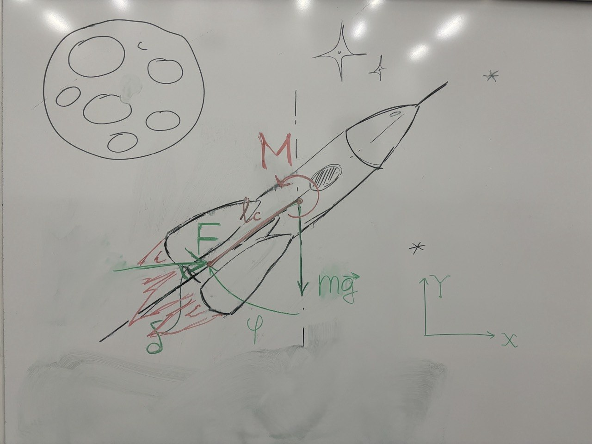

# Mathematical Derivations and Analysis: Planar TVC Rocket Attitude Control

This document provides detailed mathematical derivations and analysis for the planar TVC rocket attitude stabilization system. It serves as a comprehensive reference for the theoretical foundations of the Lyapunov-based control strategy implemented in this repository.

## Table of Contents

- [Plant Description](#plant-description)
  - [System Diagram](#system-diagram)
  - [State Variables and Control Inputs](#state-variables-and-control-inputs)
  - [System Parameters](#system-parameters)
  - [Equations of Motion](#equations-of-motion)
- [Simplifying Assumptions](#simplifying-assumptions)
- [Lyapunov-Based Attitude Control](#lyapunov-based-attitude-control)
  - [Control Objective](#control-objective)
  - [Lyapunov Function Candidate](#lyapunov-function-candidate)
  - [Control Law Derivation](#control-law-derivation)
  - [Solvability Condition](#solvability-condition)
- [Stability Analysis](#stability-analysis)
- [Controller Implementation Details](#controller-implementation-details)
- [Cross-Term Lyapunov Attitude Control](#cross-term-lyapunov-attitude-control)
  - [Motivation](#motivation)
  - [Lyapunov Function Candidate](#lyapunov-function-candidate-1)
  - [Control Law Derivation](#control-law-derivation-1)
  - [Singularity Protection](#singularity-protection)
  - [Gain Conditions](#gain-conditions)
- [References](#references)

---

## Plant Description

The system is a planar (2D) rocket with thrust vector control (TVC). A single engine is mounted at the base of the rocket. The nozzle can be deflected by a nozzle deflection angle $\delta$ relative to the body axis, redirecting the thrust vector and generating a corrective torque about the center of mass. This is the same actuation principle used in Falcon 9 during powered descent.

### System Diagram



The pitch angle $\phi$ is measured from the vertical (+y axis), positive rightward. The nozzle deflection angle $\delta$ is measured from the rocket body axis, positive rightward. The thrust $F$ acts along the nozzle axis.

### State Variables and Control Inputs

The system state vector is:

$$
q = [x,\ y,\ \phi,\ \dot{x},\ \dot{y},\ \dot{\phi}]^T
$$

where:
- $x, y$ — inertial horizontal and vertical position (m)
- $\phi$ — pitch angle from vertical, positive rightward (rad)
- $\dot{x}, \dot{y}$ — inertial velocities (m/s)
- $\dot{\phi}$ — angular rate (rad/s)

The sole control input is the nozzle deflection angle:

$$
u = \delta, \qquad |\delta| \leq \delta_{max}
$$


### System Parameters

| Symbol | Meaning | Units |
|--------|---------|-------|
| $m$ | Total mass (constant under P1 assumption) | kg |
| $J$ | Moment of inertia about CoM (constant) | kg·m² |
| $l_{cp}$ | Distance from CoM to nozzle exit | m |
| $g$ | Gravitational acceleration, 9.81 | m/s² |
| $F_{max}$ | Maximum thrust | N |
| $\delta_{max}$ | Nozzle angle limit | rad |
| $F$ | Constant thrust $= mg$ | N |

## Simplifying Assumptions

The following assumptions are made for Project 1 and must be stated explicitly in any analysis using these equations:

1. **Constant mass**: Mass is treated as fixed, $\dot{m} = 0$. Consequently $\dot{J} = 0$ and $J$, $l_{cp}$ are constants. This eliminates the variable-inertia coupling term and simplifies the Lyapunov analysis from a time-varying to a time-invariant problem. For typical mission durations where fuel mass is a small fraction of total mass, this is a reasonable first approximation.

2. **No aerodynamic drag**: Translational drag $(\beta = 0)$ and rotational aerodynamic moment $(\beta_r = 0)$ are neglected. At low velocities this is acceptable; at higher speeds drag provides additional passive damping that only helps stability.

3. **Attitude-only control**: The control objective is restricted to stabilizing $\phi \to 0$, $\dot{\phi} \to 0$. Translational states $(x, y, \dot{x}, \dot{y})$ evolve freely and are not controlled. The throttle is fixed at $\alpha = mg / F_{max}$, giving constant thrust $F = mg$. Horizontal velocity accumulated during attitude correction is not cancelled — this is a stated limitation of P1.

### Equations of Motion

The throttle is fixed at the hover value so that thrust exactly balances gravity:

$$
F = mg
$$

**Newton's second law** (translational dynamics). The translational states $x$, $y$, $\dot{x}$, $\dot{y}$ evolve freely — they are not controlled:

$$
m\ddot{x} = F\sin(\phi + \delta)
$$

$$
m\ddot{y} = F\cos(\phi + \delta) - mg
$$

Substituting $F = mg$:

$$
\ddot{x} = g\sin(\phi + \delta), \qquad \ddot{y} = g\cos(\phi + \delta) - g
$$

At equilibrium ($\phi = 0$, $\delta = 0$), $\ddot{y} = 0$ — gravity is exactly balanced. Any horizontal velocity accumulated during attitude correction persists since there is no mechanism to cancel it.

**Angular momentum equation** ($\dot{L} = \tau$, torque about the CoM). The thrust $F$ acts at distance $l_{cp}$ from the CoM along the nozzle axis, generating torque $\tau = -F \cdot l_{cp} \sin(\delta)$:

$$
J\ddot{\phi} = -F \cdot l_{cp} \sin(\delta)
$$

Substituting $F = mg$:

$$
\ddot{\phi} = -\frac{mg \cdot l_{cp}}{J} \sin(\delta)
$$

The quantity $mg \cdot l_{cp} / J$ represents the maximum angular acceleration per unit $\sin(\delta)$. The negative sign reflects the restoring convention: positive $\delta$ generates a negative angular acceleration, correcting positive pitch.


---

## Lyapunov-Based Attitude Control

### Control Objective

The equilibrium to be stabilized is the upright hover condition:

$$
\phi^* = 0, \quad \dot{\phi}^* = 0
$$

We define the attitude error coordinates:

$$
e_\phi = \phi - \phi^* = \phi, \qquad \dot{e}_\phi = \dot{\phi}
$$

The sole control input is $\delta$. The thrust is constant at $F = mg$ (from Assumption 3), so the attitude dynamics reduce to:

$$
\ddot{\phi} = -\frac{mg \cdot l_{cp}}{J} \sin(\delta)
$$

### Lyapunov Function Candidate

We propose the following quadratic Lyapunov function candidate over the attitude error states:

$$
V = \frac{1}{2} k_\phi e_\phi^2 + \frac{1}{2} \dot{\phi}^2
$$

where $k_\phi > 0$ is a positive gain. This function has two components:
1. **Position term** $\frac{1}{2} k_\phi e_\phi^2$: penalizes pitch angle deviation from zero.
2. **Velocity term** $\frac{1}{2} \dot{\phi}^2$: penalizes angular rate.

**Verification that $V$ is a valid Lyapunov candidate:**

- $V(0, 0) = 0$ — zero at the equilibrium. ✓
- $V(e_\phi, \dot{\phi}) > 0$ for all $(e_\phi, \dot{\phi}) \neq (0, 0)$ since both terms are non-negative and $k_\phi > 0$. ✓
- $V \to \infty$ as $\|(e_\phi, \dot{\phi})\| \to \infty$ — radially unbounded. ✓

### Control Law Derivation

Taking the time derivative of $V$ along the system trajectories:

$$
\dot{V} = k_\phi e_\phi \dot{e}_\phi + \dot{\phi} \ddot{\phi}
$$

Since $e_\phi = \phi$ and $\dot{e}_\phi = \dot{\phi}$, this becomes:

$$
\dot{V} = k_\phi \phi \dot{\phi} + \dot{\phi} \ddot{\phi}
$$

Factoring out $\dot{\phi}$:

$$
\dot{V} = \dot{\phi} \left( k_\phi \phi + \ddot{\phi} \right)
$$

Substituting the attitude dynamics:

$$
\dot{V} = \dot{\phi} \left( k_\phi \phi - \frac{mg \cdot l_{cp}}{J} \sin(\delta) \right)
$$

To guarantee $\dot{V} \leq 0$, we require the expression in parentheses to be proportional to $-\dot{\phi}$ with a positive coefficient. We set:

$$
k_\phi \phi - \frac{mg \cdot l_{cp}}{J} \sin(\delta) = -k_\omega \dot{\phi}
$$

where $k_\omega > 0$ is a damping gain. Substituting back:

$$
\dot{V} = -k_\omega \dot{\phi}^2 \leq 0
$$

This is negative semi-definite for all $k_\omega > 0$.

Solving for $\delta$:

$$
\sin(\delta) = \frac{J}{mg \cdot l_{cp}} \left( k_\phi \phi + k_\omega \dot{\phi} \right)
$$

$$
\delta = \arcsin\left(\mathrm{clamp}\left(\frac{J}{mg \cdot l_{cp}} \left( k_\phi \phi + k_\omega \dot{\phi} \right),\ -1,\ 1\right)\right)
$$

The clamp operation enforces $|\sin(\delta)| \leq 1$ — ensuring the argument remains in the domain of $\arcsin$. Gimbal angle saturation is then applied as a second constraint:

$$
\delta \leftarrow \mathrm{clamp}(\delta,\ -\delta_{max},\ \delta_{max})
$$

### Solvability Condition

The control law requires the denominator $mg \cdot l_{cp} \neq 0$. Since $F = mg > 0$ always (the engine is on by assumption) and $l_{cp} > 0$ for any physical rocket where the CoM is above the nozzle, this condition is always satisfied. No singularity guard is needed in implementation.

To avoid nozzle deflection saturation during normal operation, the gains should be chosen such that:

$$
\frac{J}{mg \cdot l_{cp}} \left( k_\phi |\phi|_{max} + k_\omega |\dot{\phi}|_{max} \right) \leq 1
$$

If this is violated, $\dot{V} \leq 0$ is still maintained — a saturated nozzle cannot worsen stability — but the rate of convergence slows.

---

## Stability Analysis

The construction of the control law already contains the stability argument. We summarise it here explicitly.

From the derivation above, $\dot{V} = -k_\omega \dot{\phi}^2 \leq 0$ along all trajectories, so $V$ is non-increasing and all trajectories are bounded. $\dot{V} = 0$ only when $\dot{\phi} = 0$.

Applying **LaSalle's invariance principle**: in the largest invariant set where $\dot{\phi} = 0$, the dynamics require $\ddot{\phi} = 0$ as well. Substituting into the attitude equation:

$$
0 = -\frac{mg \cdot l_{cp}}{J} \sin(\delta)
$$

Since $mg \cdot l_{cp} / J > 0$, this gives $\sin(\delta) = 0$. Substituting back with $\dot{\phi} = 0$:

$$
k_\phi \phi = 0 \implies \phi = 0
$$

The largest invariant set is therefore the single point $(\phi, \dot{\phi}) = (0, 0)$. By LaSalle's invariance principle, **all trajectories converge asymptotically to the upright equilibrium**.

**What this guarantees**: convergence $\phi(t) \to 0$, $\dot{\phi}(t) \to 0$ as $t \to \infty$, from any initial condition, provided the nozzle does not saturate persistently.

**Where the result is approximate**: the constant-mass assumption means the proof strictly applies to a time-invariant system. For slowly varying mass the result holds approximately. When nozzle deflection saturation is active, $\dot{V} \leq 0$ is preserved but convergence may slow.

---

## Controller Implementation Details

The controller is implemented as a stateless function evaluated at each ODE integration step.

```python
def compute_control(self, state: np.ndarray, params: RocketParams):
    phi   = float(state[2])
    omega = float(state[5])

    alpha    = params.alpha_hover
    e_phi    = wrap_angle(phi - self.phi_target)

    authority = max(alpha * params.F_max * params.l_cp, 1e-8)
    sin_delta = (params.J_const / authority) * (self.k_phi * e_phi + self.k_omega * omega)
    sin_delta = float(np.clip(sin_delta, -1.0, 1.0))
    delta     = math.asin(sin_delta)
    delta     = float(np.clip(delta, -params.delta_max, params.delta_max))

    return alpha, delta
```

**Required gain conditions for stability:**

$$
k_\phi > 0, \quad k_\omega > 0
$$

**Default values** for the project rocket ($m = 1.60$ kg, $l_{cp} = 0.6091$ m, $J = 0.1183$ kg·m²):

| Parameter | Value | Role |
|-----------|-------|------|
| $k_\phi$ | 18.0 | Proportional attitude restoring |
| $k_\omega$ | 7.0 | Angular rate damping |
| $\delta_{max}$ | 15 deg | Nozzle deflection limit |

Tuning guideline: increase $k_\omega$ first if the response oscillates; increase $k_\phi$ if convergence is too slow.

**Monitoring $V(t)$ in simulation:**

```python
def lyapunov_value(state, params):
    """Compute V along the trajectory — must be monotonically decreasing."""
    phi   = state[2]
    omega = state[5]
    k_phi = params['k_phi']
    return 0.5 * k_phi * phi**2 + 0.5 * omega**2
```

Plot $V(t)$ alongside the state trajectories. A monotonically decreasing $V(t)$ is the numerical verification of the theoretical guarantee $\dot{V} \leq 0$.

---

## Cross-Term Lyapunov Attitude Control

### Motivation

The basic Lyapunov controller gives $\dot{V} = -k_\omega \dot{\phi}^2$, which is only negative semi-definite — it does not directly penalize $e_\phi$ in $\dot{V}$. Adding a cross term $c\,e_\phi\dot{\phi}$ to the Lyapunov function introduces coupling between position and velocity errors, which can yield a faster or smoother transient response.

### Lyapunov Function Candidate

$$
V = \frac{1}{2} k_\phi e_\phi^2 + \frac{1}{2} \dot{\phi}^2 + c\, e_\phi \dot{\phi}
$$

where $c > 0$ is the cross-term gain. Unlike the basic quadratic Lyapunov function, $V$ is **not automatically positive definite** — the cross term $c\,e_\phi\dot{\phi}$ can be negative. Writing $V$ in matrix form:

$$
V = \begin{bmatrix} e_\phi \\ \dot{\phi} \end{bmatrix}^T \begin{bmatrix} \frac{1}{2}k_\phi & \frac{c}{2} \\ \frac{c}{2} & \frac{1}{2} \end{bmatrix} \begin{bmatrix} e_\phi \\ \dot{\phi} \end{bmatrix}
$$

By Sylvester's criterion, this matrix is positive definite if and only if both leading minors are positive:

$$
k_\phi > 0 \quad \text{and} \quad \frac{k_\phi - c^2}{4} > 0 \implies |c| < \sqrt{k_\phi}
$$

**This is a hard requirement on the gains.** If $|c| \geq \sqrt{k_\phi}$, $V$ is not a valid Lyapunov function and stability is not guaranteed. For the default gains $k_\phi = 25$, $c = 0.2$: $|c| = 0.2 < \sqrt{25} = 5$ ✓.

### Control Law Derivation

Taking the time derivative of $V$:

$$
\dot{V} = k_\phi e_\phi \dot{\phi} + \dot{\phi} \ddot{\phi} + c\, \dot{\phi}^2 + c\, e_\phi \ddot{\phi}
$$

Factoring out $\ddot{\phi}$:

$$
\dot{V} = k_\phi e_\phi \dot{\phi} + c\, \dot{\phi}^2 + \ddot{\phi}\left(\dot{\phi} + c\, e_\phi\right)
$$

Substituting the attitude dynamics $\ddot{\phi} = -\frac{mg \cdot l_{cp}}{J} \sin(\delta)$:

$$
\dot{V} = k_\phi e_\phi \dot{\phi} + c\, \dot{\phi}^2 - \frac{mg \cdot l_{cp}}{J} \sin(\delta) \left(\dot{\phi} + c\, e_\phi\right)
$$

To make $\dot{V} \leq 0$, we require $\dot{V} = -k_c e_\phi^2 - k_\omega \dot{\phi}^2$ with $k_c, k_\omega > 0$. Setting:

$$
k_\phi e_\phi \dot{\phi} + c\, \dot{\phi}^2 - \frac{mg \cdot l_{cp}}{J} \sin(\delta)\left(\dot{\phi} + c\, e_\phi\right) = -k_c e_\phi^2 - k_\omega \dot{\phi}^2
$$

Solving for $\sin(\delta)$:

$$
\frac{mg \cdot l_{cp}}{J} \sin(\delta)\left(\dot{\phi} + c\, e_\phi\right) = k_\phi e_\phi \dot{\phi} + (c + k_\omega)\dot{\phi}^2 + k_c e_\phi^2
$$

Defining the numerator $n$ and denominator $d$:

$$
n = k_\phi e_\phi \dot{\phi} + (c + k_\omega)\dot{\phi}^2 + k_c e_\phi^2
$$

$$
d = \dot{\phi} + c\, e_\phi
$$

The control law is:

$$
\sin(\delta) = \frac{J}{mg \cdot l_{cp}} \cdot \frac{n}{d}
$$

$$
\delta = \arcsin\left(\mathrm{clamp}\left(\frac{J}{mg \cdot l_{cp}} \cdot \frac{n}{d},\ -1,\ 1\right)\right)
$$

followed by a hard saturation to $[-\delta_{max},\ \delta_{max}]$.

This gives $\dot{V} = -k_c e_\phi^2 - k_\omega \dot{\phi}^2 \leq 0$, which is negative semi-definite. By LaSalle's invariance principle, all trajectories converge to $(\phi, \dot{\phi}) = (0, 0)$.

### Singularity Protection

The denominator $d = \dot{\phi} + c\,e_\phi = 0$ when the state lies on the line $\dot{\phi} = -c\,e_\phi$ in the phase plane. At this point the control law is undefined. In the implementation, when $|d| < \varepsilon$, the controller falls back to the basic Lyapunov attitude law.

### Gain Conditions

For $V$ to be a valid Lyapunov function and stability to be guaranteed:

$$
k_\phi > 0, \quad k_\omega > 0, \quad k_c > 0, \quad 0 < c < \sqrt{k_\phi}
$$

The condition $c < \sqrt{k_\phi}$ is necessary for positive definiteness of $V$ and must be verified before deploying any gain set.

### Implementation

```python
def compute_control(self, state: np.ndarray, params: RocketParams):
    phi   = float(state[2])
    omega = float(state[5])

    alpha    = params.alpha_hover
    e_phi    = wrap_angle(phi - self.phi_target)

    authority = max(alpha * params.F_max * params.l_cp, 1e-8)
    pd_term   = self.k_phi * e_phi + self.k_omega * omega

    numerator   = self.k_phi * e_phi * omega + (self.c + self.k_omega) * (omega ** 2) + self.k_c * (e_phi ** 2)
    denominator = omega + self.c * e_phi

    if abs(denominator) < self.eps:
        sin_delta = (params.J_const / authority) * pd_term
    else:
        sin_delta = (params.J_const / authority) * (numerator / denominator)

    sin_delta = float(np.clip(sin_delta, -1.0, 1.0))
    delta     = math.asin(sin_delta)
    delta     = float(np.clip(delta, -params.delta_max, params.delta_max))

    return alpha, delta
```

---

## References

1. Khalil, H. K. (2002). *Nonlinear Systems* (3rd ed.). Prentice Hall. — Standard reference for Lyapunov stability theory and LaSalle's invariance principle.

2. Slotine, J.-J. E., & Li, W. (1991). *Applied Nonlinear Control*. Prentice Hall. — Chapter 4 for Lyapunov-based controller design methodology.

3. Wie, B. (1998). *Space Vehicle Dynamics and Control*. AIAA Education Series. — Attitude control of launch vehicles with thrust vector control.

4. Isidori, A. (1995). *Nonlinear Control Systems* (3rd ed.). Springer. — Cascade systems and timescale separation arguments.
