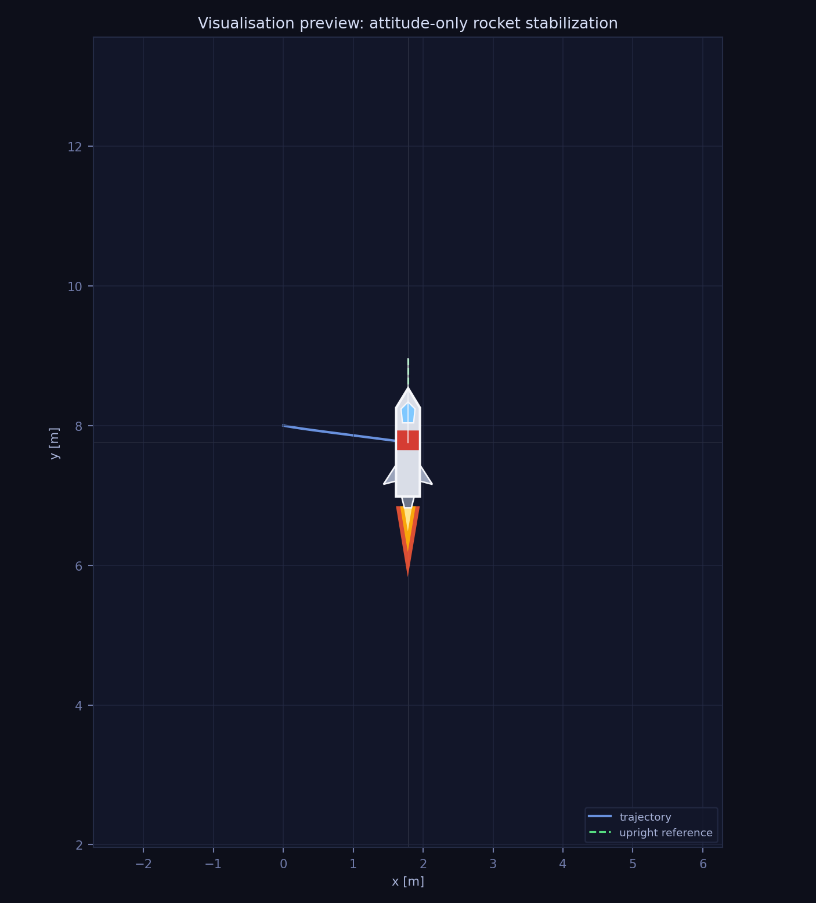
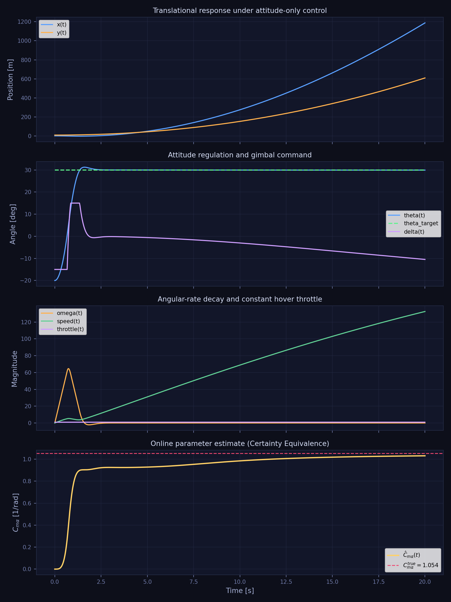
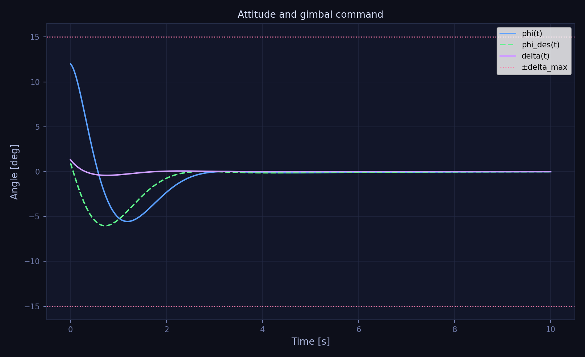
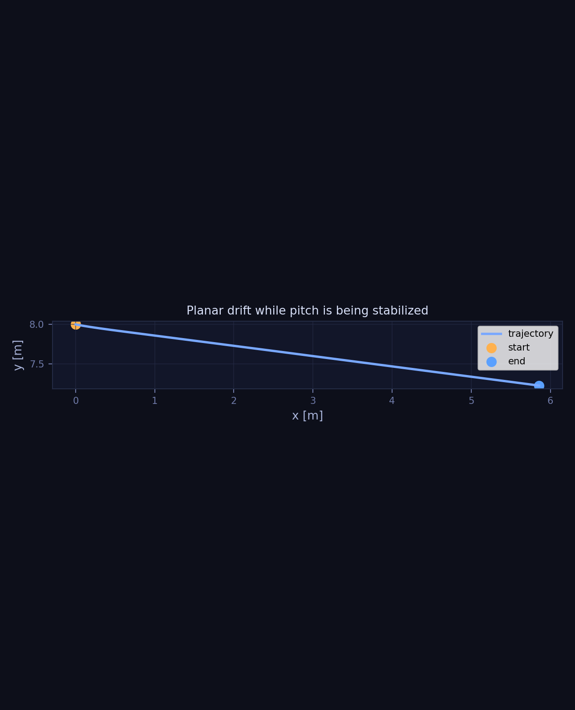
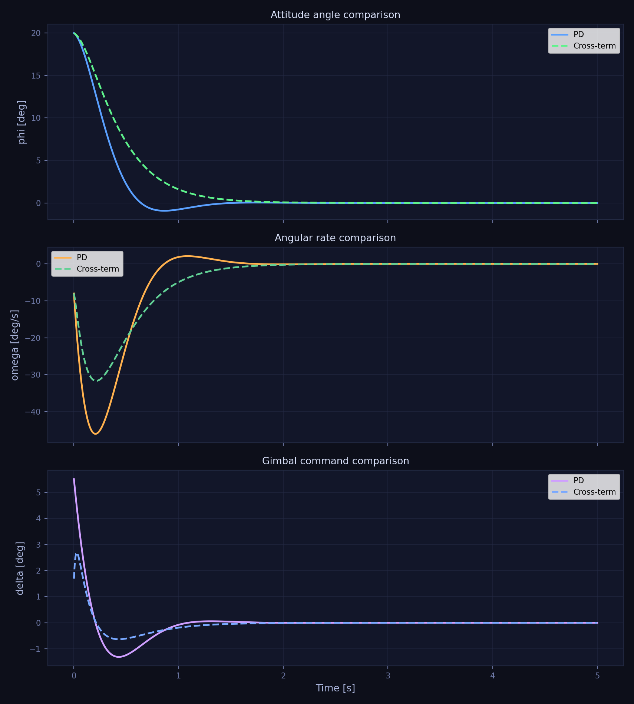

# Project 1 — Planar TVC Rocket with Lyapunov Hover Control



## Overview
This repository implements a **planar thrust-vector-controlled rocket** with two inner-loop attitude regulators:
- a baseline **Lyapunov PD** controller;
- a **cross-term Lyapunov** controller.

The simulation pipeline runs both controllers from the same initial condition and generates a direct comparison plot, while preserving all original PD outputs (plots, animation, and JSON summary).

The default hover target is
- **position:** `(x_d, y_d) = (0.0, 8.0) m`
- **pitch:** `phi = 0 rad`
- **velocity:** `vx = 0, vy = 0`
- **angular rate:** `omega = 0`

## Quick Start
Create an environment and install the dependencies:

```bash
python -m venv .venv
source .venv/bin/activate
pip install -r requirements.txt
```

Regenerate all figures, the summary file, and the corrected real-time MP4 animation:

```bash
bash run_project.sh
```

Equivalent direct command:

```bash
python -m src.main --config configs/default.yaml --output-root .
```

Generated outputs:
- `figures/state_trajectories.png`
- `figures/attitude_and_gimbal.png`
- `figures/control_and_error.png`
- `figures/planar_trajectory.png`
- `figures/rocket_visualization_preview.png`
- `figures/comparison.png`
- `figures/summary.json`
- `animations/rocket_attitude_realtime.mp4`

## Repository Structure
```text
project_1_lyapunov_control_planar_tvc_rocket/
├── README.md
├── README-derivation-lyapunov.md
├── requirements.txt
├── run_project.sh
├── configs/
│   └── default.yaml
├── src/
│   ├── __init__.py
│   ├── controller.py
│   ├── main.py
│   ├── simulation.py
│   ├── system.py
│   └── visualization.py
├── figures/
│   ├── attitude_and_gimbal.png
│   ├── control_and_error.png
│   ├── planar_trajectory.png
│   ├── rocket_visualization_preview.png
│   ├── state_trajectories.png
│   └── summary.json
└── animations/
    └── rocket_attitude_realtime.mp4
```

## 1. Problem Definition
The control task is to stabilize a planar rocket to a stationary hover point under gravity, bounded gimbal actuation, bounded throttle, translational drag, and fuel depletion.

### Method class
The method belongs to **Lyapunov-based nonlinear control** and uses a two-layer structure:
1. an **outer position loop** computes the desired thrust direction and thrust magnitude;
2. an **inner attitude loop** computes the nozzle gimbal command that drives the rocket pitch toward the desired pitch.

### Context and assumptions
- The rocket is planar, so the state contains one attitude angle and one angular rate.
- The control moment arm `l_cp` and the inertia `J_const` are frozen at midpoint mass for Project 1.
- Rotational aerodynamic damping is neglected.
- Fuel depletion is included explicitly, so the hover throttle slowly decreases during the run.
- The attitude loop is tuned faster than the position loop.

## 2. System Description
### State, control, and notation
The state is

$$
q = [x, y, \phi, \dot{x}, \dot{y}, \dot{\phi}, m]^T
$$

where
- `x, y` are inertial horizontal and vertical positions in meters,
- `phi` is the pitch angle from the vertical axis in radians,
- `vx = dot x` and `vy = dot y` are translational velocities in meters per second,
- `omega = dot phi` is the angular rate in radians per second,
- `m` is the instantaneous mass in kilograms.

The control input is

$$
u = [\alpha, \delta]^T
$$

where
- `alpha in [0, 1]` is the throttle command,
- `delta` is the nozzle gimbal angle with `|delta| <= delta_max`.

### Nonlinear dynamics used in the code
With thrust `F = alpha F_max`, translational drag coefficient `beta_drag`, and midpoint approximations for `J_const` and `l_cp`, the implemented dynamics are

$$
\dot{m} = -\alpha \dot{m}_{max}
$$

$$
\ddot{x} = \frac{\alpha F_{max}}{m}\sin(\phi + \delta) - \frac{\beta_{drag}}{m}\dot{x}\sqrt{\dot{x}^2 + \dot{y}^2}
$$

$$
\ddot{y} = \frac{\alpha F_{max}}{m}\cos(\phi + \delta) - g - \frac{\beta_{drag}}{m}\dot{y}\sqrt{\dot{x}^2 + \dot{y}^2}
$$

$$
\ddot{\phi} = -\frac{\alpha F_{max} l_{cp}}{J_{const}}\sin(\delta)
$$

The code computes `F_max = m_dot_max * v_e` from the mass-flow rate and effective exhaust velocity, then computes midpoint-mass values of `l_cp` and `J_const` from the dry structure and fuel geometry.

### Constraints
- `alpha_min <= alpha <= 1`
- `|delta| <= delta_max`
- `m >= m_dry`

When the dry mass is reached, the thrust is set to zero and further fuel depletion stops.

## 3. Mathematical Specification

The controller stabilizes attitude only. The throttle is fixed at the hover value $\alpha = \alpha_{hover}$ and is not a control variable. The sole control input is the gimbal angle $\delta$.

### Lyapunov attitude law

The attitude error and angular rate are:

$$
e_\phi = \mathrm{wrap}(\phi - \phi_{target}), \qquad \dot{\phi} = \omega
$$

The Lyapunov function candidate is:

$$
V = \frac{1}{2} k_\phi e_\phi^2 + \frac{1}{2} \dot{\phi}^2
$$

Taking the time derivative along the attitude dynamics and requiring $\dot{V} \leq 0$ yields the gimbal command:

$$
\sin(\delta) = \frac{J_{const}}{\alpha F_{max} l_{cp}}\left(k_\phi e_\phi + k_\omega \dot{\phi}\right)
$$

$$
\delta = \arcsin\left(\mathrm{clamp}\left(\frac{J_{const}}{\alpha F_{max} l_{cp}}\left(k_\phi e_\phi + k_\omega \dot{\phi}\right),\ -1,\ 1\right)\right)
$$

followed by a hard saturation to `[-delta_max, delta_max]`. This gives $\dot{V} = -k_\omega \dot{\phi}^2 \leq 0$, and by LaSalle's invariance principle all trajectories converge to $(\phi, \dot{\phi}) = (0, 0)$.

For the full derivation see [README-derivation-lyapunov.md](README-derivation-lyapunov.md).

### Cross-term Lyapunov attitude law

For the cross-term regulator, the Lyapunov candidate adds a cross term:

$$
V = \frac{1}{2}k_\phi e_\phi^2 + \frac{1}{2}\dot{\phi}^2 + c\, e_\phi \dot{\phi}
$$

Taking $\dot{V} \leq 0$ with this candidate yields:

$$
n = k_\phi e_\phi \dot{\phi} + (c + k_\omega)\dot{\phi}^2 + k_c e_\phi^2
$$

$$
d = \dot{\phi} + c\, e_\phi
$$

$$
\sin(\delta) = \frac{J_{const}}{\alpha F_{max} l_{cp}} \cdot \frac{n}{d}
$$

followed by the same `arcsin` and hard saturation to `[-delta_max, delta_max]`. If `|d| < eps`, the implementation falls back to the PD law for numerical robustness.

### Stability interpretation
- The controller drives the rocket pitch toward $\phi_{target} = 0$ and damps angular motion via a Lyapunov argument guaranteeing $\dot{V} \leq 0$.
- Translational states $(x, y, \dot{x}, \dot{y})$ evolve freely and are not controlled.
- Translational drag is not cancelled, so it contributes extra passive dissipation.

The code intentionally implements the simplified Project 1 model, not a fully parameter-varying rocket. A longer derivation note is included in [README-derivation-lyapunov.md](README-derivation-lyapunov.md).

## 4. Method Description
### Control pipeline
At every integration step the code performs the following pipeline:
1. read the current state `(x, y, phi, vx, vy, omega, mass)`;
2. compute the attitude error `e_phi = wrap(phi - phi_target)`;
3. compute the gimbal angle `delta` from the Lyapunov attitude law;
4. propagate the nonlinear dynamics with `solve_ivp`;
5. post-process the state history into plots, an animation, and summary metrics.

### Why the controller works in practice
The Lyapunov attitude law drives `phi` and `omega` to zero by construction — $\dot{V} \leq 0$ is guaranteed for all $k_\phi > 0$, $k_\omega > 0$. Translational states evolve freely under the fixed hover throttle.

## 5. Experimental Setup
### Initial condition
- `x(0) = -2.0 m`
- `y(0) = 1.0 m`
- `phi(0) = 12.0 deg`
- `vx(0) = 0.5 m/s`
- `vy(0) = 0.0 m/s`
- `omega(0) = -5.0 deg/s`
- `m(0) = 1.60 kg`

### Target state
- `phi_target = 0.0 rad`
- `omega_target = 0.0 rad/s`

Translational states are not controlled — position and velocity evolve freely.

### Physical parameters
- `g = 9.81 m/s^2`
- `beta_drag = 0.08`
- `m_dry = 1.05 kg`
- `m_dot_max = 0.02 kg/s`
- `v_e = 1200 m/s`
- `delta_max = 15 deg`
- `alpha_min = 0.20`
- `F_max = 24.0 N`
- `l_cp = 0.6091 m` at midpoint mass
- `J_const = 0.1183 kg m^2` at midpoint mass

### Controller gains (PD Lyapunov)
- `k_phi = 25.0`
- `k_omega = 7.0`
- `phi_target_deg = 0.0`

### Controller gains (cross-term Lyapunov)
- `k_phi = 25.0`
- `k_omega = 10.0`
- `k_c = 7.0`
- `c = 0.2`
- `phi_target_deg = 0.0`

### Numerical setup
- final simulation time: `20.0 s`
- sample count: `1201`
- integrator: `scipy.integrate.solve_ivp`
- integrator max step: `0.02 s`

## 6. Reproducibility
The repository includes exact commands, a dependency file, and a deterministic default configuration.

### Reproduce the final outputs
From the repository root, run:

```bash
python -m venv .venv
source .venv/bin/activate
pip install -r requirements.txt
python -m src.main --config configs/default.yaml --output-root .
```

### What each module does
- `src/system.py` defines the rocket parameters and nonlinear right-hand side;
- `src/controller.py` implements two attitude regulators: `AttitudeLyapunovController` and `CrossTermLyapunovController`;
- `src/simulation.py` integrates the system and provides `simulate` (PD) plus `simulate_both` (PD + cross-term);
- `src/visualization.py` generates all figures, including `comparison.png`, and the corrected real-time MP4 animation;
- `src/main.py` runs both regulators and writes a combined `figures/summary.json` (`pd`, `cross_term`, `comparison`).

## 7. Results Summary
Both regulators converge in attitude (`phi -> 0`, `omega -> 0`) in the default experiment. The cross-term regulator reduces peak gimbal demand but increases translational speed and drift compared with the PD baseline.

### Quantitative results
- **PD controller**
  - final position: `(4.286100220018184, 7.317845231040285) m`
  - final pitch: `-9.289540202597493e-08 deg`
  - final angular rate: `2.6765738366331744e-06 deg/s`
  - final speed: `0.8828260180662892 m/s`
  - max absolute gimbal: `5.50247288376789 deg`
  - max speed: `0.9787758492524684 m/s`
- **Cross-term controller**
  - final position: `(7.218912011175233, 7.153153571277549) m`
  - final pitch: `4.8792597768221715e-06 deg`
  - final angular rate: `-1.911513020195674e-05 deg/s`
  - final speed: `1.5609724965023237 m/s`
  - max absolute gimbal: `2.6852208077477684 deg`
  - max speed: `1.5609724965023237 m/s`
- **Difference (cross-term − PD)**
  - `final_phi_deg_diff = 4.972155178848146e-06`
  - `final_omega_deg_s_diff = -2.1791704038589914e-05`
  - `max_abs_delta_deg_diff = -2.8172520760201216 deg`
  - `max_speed_diff = 0.5821966472498553 m/s`

### What works
- Both regulators stabilize attitude and angular rate to near-zero.
- The cross-term regulator decreases peak gimbal demand compared with PD.
- The comparison pipeline is reproducible via one command and saves both plot and numeric comparison.
- The exported MP4 now matches the physical simulation time instead of playing too fast.

### Alternative regulator (cross-term)
- Lyapunov function:
  - `V = 0.5*k_phi*e_phi^2 + 0.5*omega^2 + c*e_phi*omega`
- Control law:
  - `numerator = k_phi*e_phi*omega + (c + k_omega)*omega^2 + k_c*e_phi^2`
  - `denominator = omega + c*e_phi`
  - `sin(delta) = (J / (alpha * F_max * l_cp)) * (numerator / denominator)`
- Singularity protection in code:
  - if `|denominator| < eps`, fallback to PD law.
- Practical interpretation for current tuning:
  - smoother actuator demand (`|delta|` peak lower),
  - weaker translational performance (`max_speed` and drift higher).

### Cross-term sweep summary
The repository includes a gain sweep report generated from `figures/crossterm_sweep_phi01_compact.json` with threshold `|phi| < 0.1 rad`.

| Metric | Value |
|---|---|
| Input cases | 36 |
| Converged cases | 6 |
| Non-converged cases | 30 |
| Fixed gains during sweep | `k_phi=25`, `k_omega=10` |
| Swept gains | `k_c in [0,5]`, `c in [0.2,2.2]` |

Top converged settings by persistent settling time:

| Rank | `k_c` | `c` | First entry [s] | Settling [s] | Max abs delta [deg] | Max speed [m/s] |
|---:|---:|---:|---:|---:|---:|---:|
| 1 | 0 | 0.2 | 0.4861 | 0.4861 | 10.4117 | 1.2931 |
| 2 | 1 | 0.2 | 0.4931 | 0.4931 | 9.1560 | 1.3194 |
| 3 | 2 | 0.2 | 0.5069 | 0.5069 | 7.9048 | 1.3480 |
| 4 | 3 | 0.2 | 0.5139 | 0.5139 | 6.6573 | 1.3796 |
| 5 | 4 | 0.2 | 0.5278 | 0.5278 | 5.4130 | 1.4148 |
| 6 | 5 | 0.2 | 0.5417 | 0.5417 | 4.1712 | 1.4549 |

Analysis:
- Convergence is highly concentrated in a narrow band of `c` (here only `c=0.2` converged in the tested grid).
- Small changes in `c` can move the system from fast convergence to complete non-convergence over the simulation horizon.
- Increasing `k_c` in the converged band reduces peak gimbal demand, but also tends to increase translational speed.

Conclusion:
- The cross-term regulator is significantly more sensitive to tuning than the PD baseline in this project setup.
- It can provide smoother actuator behavior, but practical tuning is difficult and requires careful grid search with explicit convergence checks.

### What remains limited
- The inertia and control moment arm are frozen at midpoint mass.
- Rotational drag, actuator dynamics, and sensor noise are omitted.
- The proof is quasi-static with respect to mass variation.
- Comparison currently uses one scenario (single initial condition and one gain set).

## 8. Figures and Interpretation
### State trajectories

The position histories show that the rocket reaches the hover target and removes the initial offsets without persistent oscillation.

### Attitude and gimbal command

The desired pitch and actual pitch quickly align, while the gimbal command remains far below the hard `15 deg` limit. The conclusion is that the inner loop has sufficient authority for the default case.

### Control effort and hover error

Throttle, speed, and position error all decay toward their hover values. The conclusion is that the closed-loop system settles smoothly instead of chattering around the target.

### Planar trajectory

The planar path bends smoothly toward the hover point. The conclusion is that the rocket reaches the target without aggressive overshoot.

### PD vs Cross-term comparison

The comparison figure shows both controllers on the same axes. In this run, the cross-term controller exhibits lower angular overshoot and a smoother gimbal profile than the PD baseline.

## 9. Animation
The project includes a corrected real-time animation:
- `animations/rocket_attitude_realtime.mp4`

The animation shows the rocket body, the hover target, the path, the current orientation, the current time, the throttle command, the gimbal angle, and the instantaneous position error.

## 10. Theory and Implementation Match
This repository intentionally implements the **simplified Project 1 model**. Specifically:
- `J_const` and `l_cp` are frozen at midpoint mass;
- the controller is the two-layer Lyapunov hover law described above;
- the README, code, plots, and animation describe the same model and assumptions.

## 11. Possible Extensions
- update `J(m)` and `l_cp(m)` online instead of freezing them;
- add actuator lag or rate limits;
- add disturbances and robustness experiments;
- include a simple baseline controller for an optional Project 1 comparison;
- extend the planar setup from hover stabilization to trajectory tracking.

## 12. Notes on AI Use
AI assistance was used to help scaffold code, restructure files, and polish the documentation and visualisation. The final equations, parameters, and interpretation of the plots should still be checked by the team before submission.
