# Project 2 — Planar TVC Rocket with Adaptive Lyapunov Attitude Control

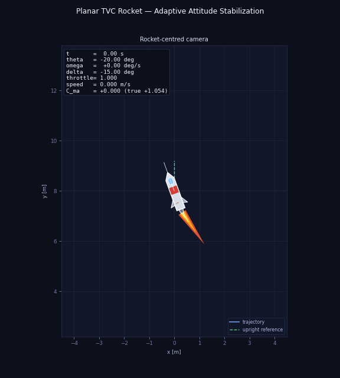

## Overview

This repository implements a **planar thrust-vector-controlled (TVC) rocket** with an adaptive attitude controller based on the **Certainty Equivalence (CE)** principle. The project extends Project 1 (Lyapunov attitude control) by introducing aerodynamic forces and treating the pitching moment coefficient $C_{m\alpha}$ as **unknown to the controller**, estimated online in real time.

Two controllers are implemented and compared:

- **P1 Baseline** (`AttitudeLyapunovController`): the Project 1 Lyapunov law applied to the aerodynamic system without aerodynamic compensation — demonstrates performance degradation when aerodynamics is ignored.
- **Adaptive controller** (`AdaptiveCEController`): extends the Lyapunov law with online estimation of $C_{m\alpha}$ via an adaptation law derived from an extended Lyapunov function.

The control objective is **attitude stabilization only**:
- pitch: $\vartheta \to \vartheta^*$ (arbitrary constant target angle)
- angular rate: $\dot\vartheta \to 0$ rad/s

Translational states $(x, y, \dot x, \dot y)$ evolve freely. Position control via backstepping is addressed in Project 3.

---

## Quick Start

```bash
python -m venv .venv
source .venv/bin/activate
pip install -r requirements.txt
bash run_project.sh
```

Equivalent direct command:

```bash
python -m src.main --config configs/default.yaml --output-root .
```

Generated outputs:

- `figures/state_trajectories.png`
- `figures/attitude_and_gimbal.png`
- `figures/parameter_estimation.png`
- `figures/lyapunov_function.png`
- `figures/comparison_baseline_vs_adaptive.png`
- `figures/phase_portrait.png`
- `figures/planar_trajectory.png`
- `figures/summary.json`
- `animations/rocket_attitude_realtime.gif`

### Configuration

All simulation parameters — initial conditions, rocket physical properties, controller gains, and simulation time — are set in `configs/default.yaml`. Edit that file to change any parameter before running.

Key parameters to tune:

| Parameter | Location in config | Effect |
|-----------|-------------------|--------|
| `theta_deg` | `initial_state` | Initial pitch angle |
| `theta_target_deg` | `controller` | Target pitch angle |
| `k_theta`, `k_omega` | `controller` | Attitude and rate gains |
| `gamma` | `controller` | Adaptation rate (higher = faster but noisier) |
| `c_hat_initial` | `controller` | Initial parameter estimate |
| `t_final` | `experiment` | Simulation duration |
| `type` | `controller` | `lyapunov` for baseline, `adaptive_ce` for adaptive |

---

## Repository Structure

```text
project_2_adaptive_control_planar_tvc_rocket/
├── README.md
├── README-derivation-adaptive.md
├── README-Aerodynamics.md
├── requirements.txt
├── run_project.sh
├── configs/
│   └── default.yaml
├── src/
│   ├── __init__.py
│   ├── system.py
│   ├── controller.py
│   ├── simulation.py
│   ├── visualization.py
│   └── main.py
├── figures/
│   └── BF_Sys.png
└── animations/
```

---

## 1. Problem Definition

The control task is to stabilize the pitch angle and angular rate of a planar TVC rocket to a target angle under gravity and aerodynamic forces, with nozzle deflection limited to $|\delta| \leq \delta_{\max}$ and fixed hover throttle. The pitching moment coefficient $C_{m\alpha}$ is **unknown to the controller** and estimated online.

**Unknown parameter:** $C_{m\alpha}$ (pitching moment coefficient, rad⁻¹) — estimated online via the adaptive law. All other physical parameters are assumed known.

### Method class

**Lyapunov-based adaptive nonlinear control** using the **Certainty Equivalence (CE)** principle:

1. A Lyapunov control law is designed as if all parameters were known — identical in structure to Project 1, with an added aerodynamic compensation term.
2. The unknown $C_{m\alpha}$ is replaced by its online estimate $\hat C_{m\alpha}(t)$.
3. The adaptation law is derived by requiring $\dot V \leq 0$ on an extended Lyapunov function that includes the parameter estimation error.

The unknown parameter enters the rotational dynamics through the same channel as the control input $\delta$ — this is the **matched uncertainty** condition, which makes CE directly applicable without backstepping.

### Context and assumptions

1. **Constant mass**: $\dot m = 0$, hence $\dot J = 0$; both $J$ and $l_{cp}$ are constants.
2. **Aerodynamics included**: Drag, normal force, and pitching moment are modelled. $C_{m\alpha}$ is unknown to the controller; $C_x$ and $C_{y\alpha}$ are treated as known constants.
3. **Low-speed regime**: Standard air density $\rho = 1.225$ kg/m³, airspeed $V \leq 100$ m/s (Mach $< 0.3$, incompressible flow). The linear aerodynamic approximations valid in $V \in [0,\,500]$ m/s are applied; in this regime $C_{m\alpha}$ is a physical constant, justifying single-scalar identification. See [`README-Aerodynamics.md`](README-Aerodynamics.md) for the full model.
4. **Matched uncertainty**: $C_{m\alpha}$ appears only in the rotational equation, in the same channel as $\delta$. Translational coefficients lie outside the angular control loop.
5. **Attitude-only control**: $(x, y, \dot x, \dot y)$ evolve freely. Throttle is fixed at $F = 1.5\,mg$.
6. **Full state measurement**: $(x, y, \vartheta, \dot x, \dot y, \dot\vartheta)$ is assumed measurable, enabling direct computation of $\alpha$ and the regressor $Y(\alpha)$.

---

## 2. System Description

### State and control

$$
q = [x,\ y,\ \vartheta,\ \dot x,\ \dot y,\ \dot\vartheta]^T, \qquad u = \delta, \quad |\delta| \leq \delta_{\max}
$$

$\vartheta$ is the pitch angle from the inertial vertical to $X_b$, positive rightward. $\delta$ is the nozzle deflection from $X_b$.

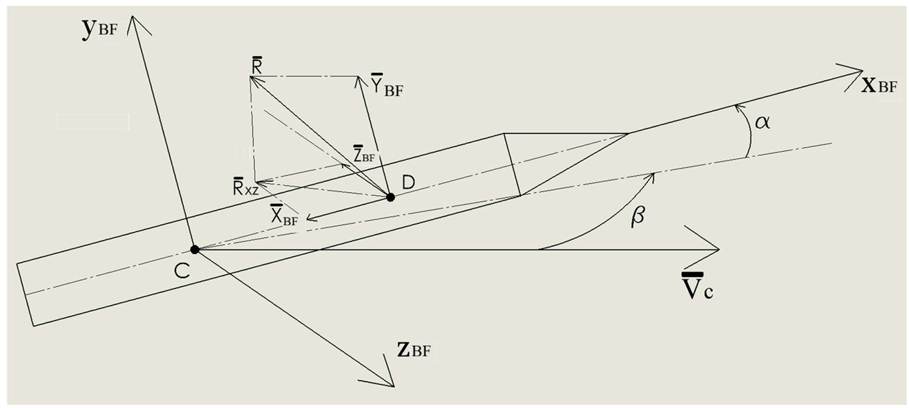

### Notation table

| Symbol | Meaning | Units |
|--------|---------|-------|
| $\vartheta$ | Pitch angle from vertical, positive rightward | rad |
| $\dot\vartheta$ | Angular rate | rad/s |
| $e_\vartheta$ | Attitude error $= \vartheta - \vartheta^*$ | rad |
| $\delta$ | Nozzle deflection angle | rad |
| $\alpha$ | Angle of attack | rad |
| $v$ | Airspeed $= \sqrt{\dot x^2 + \dot y^2}$ | m/s |
| $q_\infty$ | Dynamic pressure $= \tfrac{1}{2}\rho v^2$ | Pa |
| $F$ | Constant thrust $= 1.5\,mg$ | N |
| $Y(\alpha)$ | Regressor $= q_\infty S_m l \cdot \alpha$ | N·m |
| $C_{m\alpha}$ | True pitching moment coefficient | rad⁻¹ |
| $\hat C_{m\alpha}$ | Online estimate of $C_{m\alpha}$ | rad⁻¹ |
| $\tilde\theta$ | Estimation error $= \hat C_{m\alpha} - C_{m\alpha}$ | rad⁻¹ |
| $\gamma$ | Adaptation rate | rad² s·(N·m)⁻² |
| $k_\vartheta$ | Proportional attitude gain | rad/s² per rad |
| $k_\omega$ | Angular rate damping gain | rad/s² per rad/s |

### Auxiliary quantities

$$
v = \sqrt{\dot x^2 + \dot y^2}, \qquad
q_\infty = \tfrac{1}{2}\rho v^2, \qquad
\alpha = \vartheta - \mathrm{atan2}(\dot x,\ \dot y)
$$

At zero airspeed ($v = 0$), we set $\alpha = \vartheta$ by convention (no aerodynamic forces at zero speed).

### Aerodynamic forces and moment (body frame)

$$
X_b = -C_x \cdot q_\infty S_m, \qquad
Y_b = C_{y\alpha}\cdot\alpha \cdot q_\infty S_m, \qquad
M_b^z = C_{m\alpha}\cdot \alpha \cdot q_\infty S_m l
$$

For the full aerodynamic model, coordinate frame definition, and the body-to-inertial rotation matrix see [`README-Aerodynamics.md`](README-Aerodynamics.md).

### Equations of motion

**Translational (inertial frame):**

$$
\begin{aligned}
m\ddot x &= F\sin(\vartheta+\delta) + X_b\sin\vartheta + Y_b\cos\vartheta \\
m\ddot y &= F\cos(\vartheta+\delta) - mg + X_b\cos\vartheta - Y_b\sin\vartheta
\end{aligned}
$$

**Rotational:**

$$
J\ddot\vartheta = -F\cdot l_{cp}\sin\delta + Y(\alpha)\cdot C_{m\alpha}
$$

where $Y(\alpha) = q_\infty S_m l \cdot \alpha$ is the **regressor** — fully computable from the measured state. The unknown $C_{m\alpha}$ enters linearly, which is the structural property enabling the CE adaptation law. Note that the torque arm uses the actual thrust $F = 1.5\,mg$, not $mg$.

---

## 3. Control Law

For full derivations and formal proofs see [`README-derivation-adaptive.md`](README-derivation-adaptive.md).

### Extended Lyapunov function

$$
V = \frac{1}{2}k_\vartheta e_\vartheta^2 + \frac{1}{2}\dot\vartheta^2 + \frac{1}{2\gamma}\tilde\theta^2, \qquad e_\vartheta = \vartheta - \vartheta^*, \quad \tilde\theta = \hat C_{m\alpha} - C_{m\alpha}
$$

where $\vartheta^* \in \mathbb{R}$ is an **arbitrary constant target angle** and $\gamma > 0$. Since $\dot\vartheta^* = 0$, $\dot e_\vartheta = \dot\vartheta$ exactly. Positive definite and radially unbounded in $(e_\vartheta, \dot\vartheta, \tilde\theta)$.

### Control law (Certainty Equivalence)

$$
\boxed{\sin\delta = \frac{J}{F\cdot l_{cp}}\!\left(k_\vartheta e_\vartheta + k_\omega\dot\vartheta + \frac{Y(\alpha)}{J}\hat C_{m\alpha}\right)}
$$

The term $\tfrac{Y(\alpha)}{J}\hat C_{m\alpha}$ compensates the aerodynamic moment using the current estimate. This term is **absent in the P1 baseline**.

### Adaptation law

$$
\boxed{\dot{\hat C}_{m\alpha} = \gamma \cdot \frac{Y(\alpha)\cdot\dot\vartheta}{J}}
$$

The scalar $\gamma > 0$ is the **adaptation rate**: a larger $\gamma$ drives the estimate $\hat C_{m\alpha}$ toward the true value faster but more aggressively (may cause transient gimbal saturation if too large). With this choice:

$$
\dot V = -k_\omega\dot\vartheta^2 \leq 0
$$

### Projection safeguard

$$
\dot{\hat C}_{m\alpha} = \begin{cases}
\gamma\cdot\dfrac{Y(\alpha)\cdot\dot\vartheta}{J}, & \hat C_{m\alpha} \in [\theta_{\min},\,\theta_{\max}]\ \text{or adaptation pushes inward} \\[6pt]
0, & \text{otherwise}
\end{cases}
$$

Projection confines the estimate to physically meaningful bounds and does not violate $\dot V \leq 0$.

### Stability summary

| Claim | Status | Method |
|-------|--------|--------|
| $V(t)$ non-increasing | **Guaranteed** | $\dot V = -k_\omega\dot\vartheta^2 \leq 0$ |
| $e_\vartheta,\,\dot\vartheta,\,\tilde\theta$ bounded | **Guaranteed** | Positive definiteness + $\dot V \leq 0$ |
| $\dot\vartheta(t) \to 0$ | **Guaranteed** | Barbalat's lemma |
| $e_\vartheta(t) \to 0$ | **Guaranteed** | LaSalle + bounded translational motion |
| $\hat C_{m\alpha}(t) \to C_{m\alpha}$ | **Conditional** | Requires persistent excitation of $Y(\alpha)\cdot\dot\vartheta$ |

---

## 4. Algorithm

Pipeline executed at each integration timestep:

```
Input:  state q = (x, y, ϑ, ẋ, ẏ, ϑ̇),  current estimate Ĉ_mα

Step 1  Compute auxiliary quantities
        v      = sqrt(ẋ² + ẏ²)
        q_inf  = 0.5 * rho * v²
        alpha  = ϑ - atan2(ẋ, ẏ)        [angle of attack; = ϑ if v=0]
        Y      = q_inf * S_m * l * alpha  [regressor]

Step 2  Compute attitude error
        e_ϑ   = wrap(ϑ - ϑ_target,  -π, π)

Step 3  Compute nozzle deflection (CE control law)
        auth  = F * l_cp                  [torque authority; F = 1.5*m*g]
        sin_δ = (J / auth) * (k_ϑ * e_ϑ  +  k_ω * ϑ̇  +  Y/J * Ĉ_mα)
        δ     = arcsin(clamp(sin_δ, -1, 1))
        δ     = clamp(δ, -δ_max, δ_max)

Step 4  Update parameter estimate (with projection)
        dC    = gamma * Y * ϑ̇ / J
        Ĉ_mα ← project(Ĉ_mα + dC * dt,  θ_min, θ_max)

Step 5  Propagate dynamics via solve_ivp

Output: δ  (applied to system),  Ĉ_mα  (stored for next step)
```

---

## 5. Experimental Setup

### Initial conditions

| Variable | Value | Notes |
|----------|-------|-------|
| $x(0)$ | 0.0 m | |
| $y(0)$ | 8.0 m | |
| $\vartheta(0)$ | −20.0 deg | |
| $\dot x(0)$ | 0.0 m/s | |
| $\dot y(0)$ | 0.0 m/s | |
| $\dot\vartheta(0)$ | 0.0 deg/s | |
| $\hat C_{m\alpha}(0)$ | 0.0 rad⁻¹ | Initial estimate |

### Target state

$$
\vartheta^* = 30\ \text{deg}, \qquad \dot\vartheta^* = 0\ \text{rad/s}
$$

Any constant angle can be set via `theta_target_deg` in `configs/default.yaml`.

### Physical parameters

| Parameter | Value | Description |
|-----------|-------|-------------|
| $g$ | 9.81 m/s² | Gravitational acceleration |
| $m$ | 13000 kg | Rocket mass (constant) |
| $F_{\max}$ | 191763 N $= 1.5\,mg$ | Maximum thrust |
| $F$ | $1.5\,mg = 191763$ N | Fixed thrust (throttle = 1.0) |
| $J$ | 318196 kg·m² | Moment of inertia about CoM |
| $l_{cp}$ | 10.3 m | CoM-to-nozzle distance |
| $l$ | 18.0 m | Reference rocket length |
| $\delta_{\max}$ | 15 deg | Nozzle deflection limit |
| $\rho$ | 1.225 kg/m³ | Air density |
| $S_m$ | 3.14 m² | Reference cross-sectional area |
| $C_{m\alpha}^{\text{true}}$ | 1.054 rad⁻¹ | Ground truth (simulator only, not known to controller) |
| $C_x$ | 0.358 | Axial drag coefficient (known) |
| $C_{y\alpha}$ | 0.05403 deg⁻¹ | Normal force slope (linear regime, known) |

### Adaptive controller gains

| Gain | Value | Role |
|------|-------|------|
| $k_\vartheta$ | 18.0 | Proportional attitude restoring |
| $k_\omega$ | 7.0 | Angular rate damping |
| $\gamma$ | 700.0 | Adaptation rate |
| $\theta_{\min}$ | 0.1 rad⁻¹ | Projection lower bound |
| $\theta_{\max}$ | 5.0 rad⁻¹ | Projection upper bound |

### P1 baseline gains

| Gain | Value |
|------|-------|
| $k_\vartheta$ | 18.0 |
| $k_\omega$ | 7.0 |

*Identical gains, but zero aerodynamic compensation: $\hat C_{m\alpha} \equiv 0$.*

### Numerical setup

| Setting | Value |
|---------|-------|
| Simulation time | 20.0 s |
| Integrator | `scipy.integrate.solve_ivp`, RK45 |
| Max step | 0.02 s |

---

## 6. Reproducibility

```bash
python -m venv .venv
source .venv/bin/activate
pip install -r requirements.txt
python -m src.main --config configs/default.yaml --output-root .
```

### Module descriptions

| File | Role |
|------|------|
| `src/system.py` | Rocket parameters, aerodynamic model ($X_b$, $Y_b$, $M_b^z$), nonlinear RHS |
| `src/controller.py` | `AdaptiveCEController` (CE law + adaptation + projection) and `BaselineLyapunovController` (P1 law, no aero compensation) |
| `src/simulation.py` | `simulate_adaptive()` and `simulate_baseline()` returning full state + estimate history |
| `src/visualization.py` | All figures including parameter estimation, Lyapunov function, and comparison plot |
| `src/main.py` | Runs both controllers, writes `figures/summary.json` |

---

## 7. Results Summary

| Metric | Baseline (P1) | Adaptive |
|--------|--------------|-------------|
| Final $\vartheta$ | 26.5 deg | 29.9 deg |
| Steady-state error | **3.46 deg** | 0.08 deg |
| Final $\dot\vartheta$ | −0.24 deg/s | ≈ 0 deg/s |
| Settling time | 1.14 s | 1.14 s |
| $\hat C_{m\alpha}$ final | 0 (fixed) | 1.031 rad⁻¹ (true: 1.054, error: −2.2%) |
| Max $|\delta|$ | 15 deg (saturated) | 15 deg (saturated during transient) |

**Key finding:** The baseline fails to reach the target angle — the uncompensated aerodynamic pitching moment $Y(\alpha) \cdot C_{m\alpha}$ acts as a persistent disturbance causing 3.46 deg steady-state error. The adaptive controller converges to within 0.08 deg of the target while simultaneously estimating $C_{m\alpha}$ to within 2.2% of the true value.

### Limitations

- Translational states not controlled — lateral drift accumulates freely.
- Parameter convergence requires persistent excitation — not guaranteed for all initial conditions.
- No rotational aerodynamic damping modelled.
- Sensor noise, actuator dynamics, and time delays not included.

---

## 8. Figures and Interpretation

---

### P1 Baseline — Lyapunov attitude controller (no aerodynamic compensation)

#### Animation


#### State trajectories

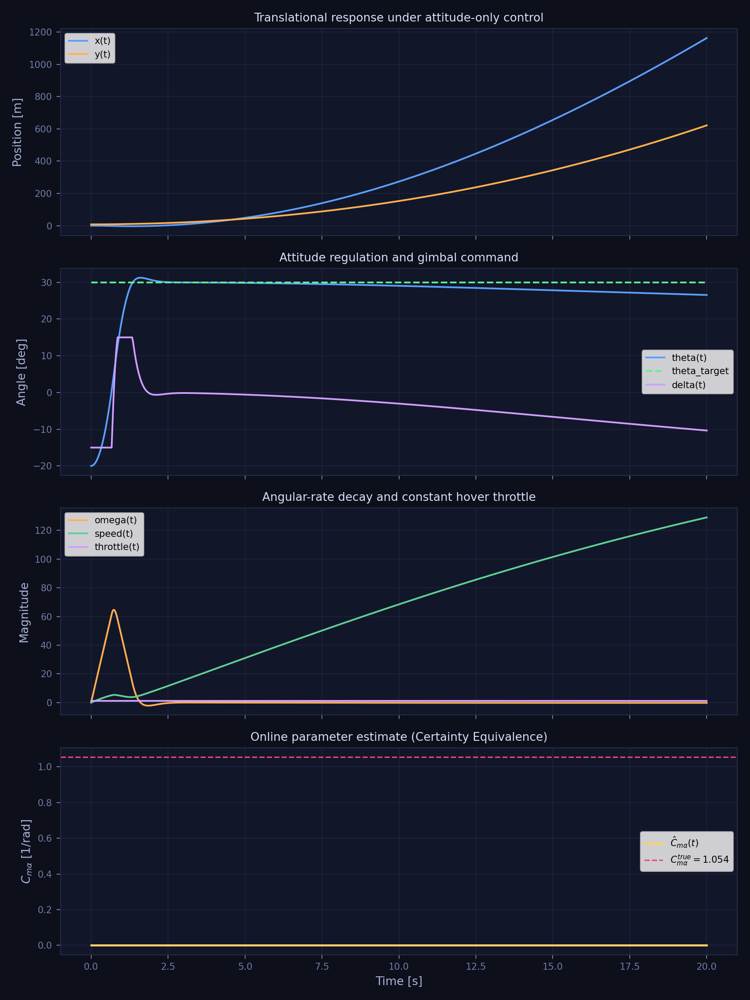

Full state over time: position $(x, y)$, pitch $\vartheta$, velocities $(\dot x, \dot y)$, angular rate $\dot\vartheta$.

#### Attitude and nozzle deflection

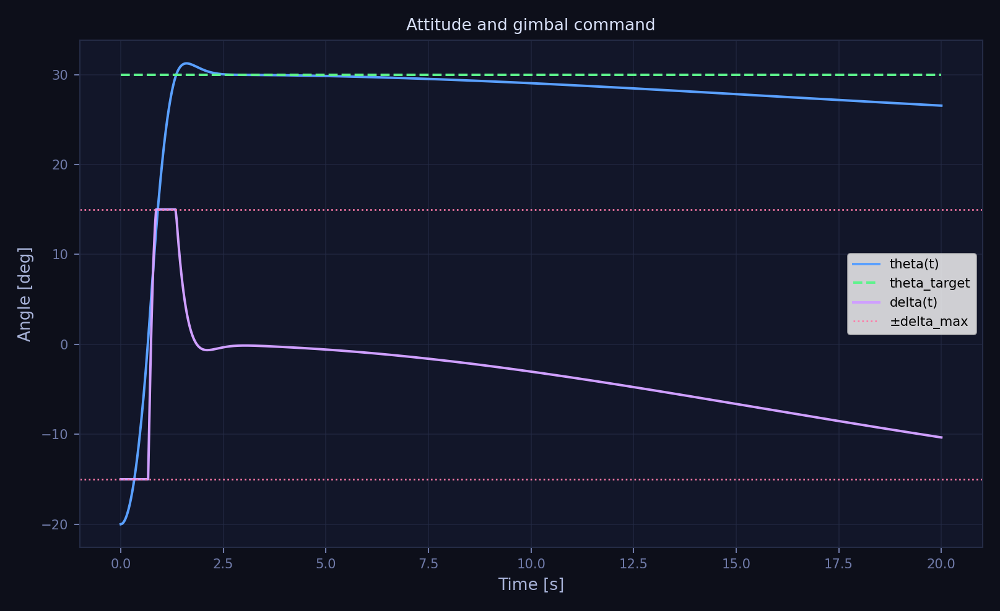

Pitch angle $\vartheta(t)$ and nozzle deflection $\delta(t)$. Without aerodynamic compensation, the baseline fails to reach the target — the uncompensated pitching moment $Y(\alpha)\cdot C_{m\alpha}$ acts as a persistent disturbance causing increasing error (`final_theta = 26.5 deg` vs target `30 deg`).

#### Lyapunov function

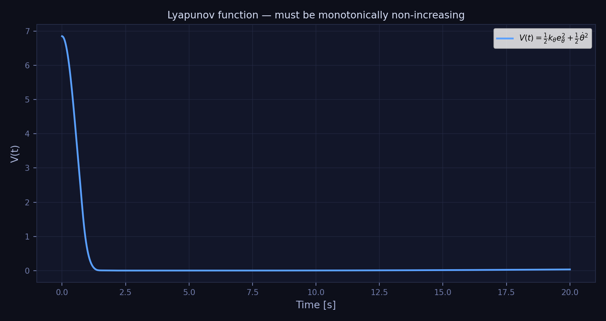

$V(t) = \frac{1}{2}k_\vartheta e_\vartheta^2 + \frac{1}{2}\dot\vartheta^2$

#### Control and error

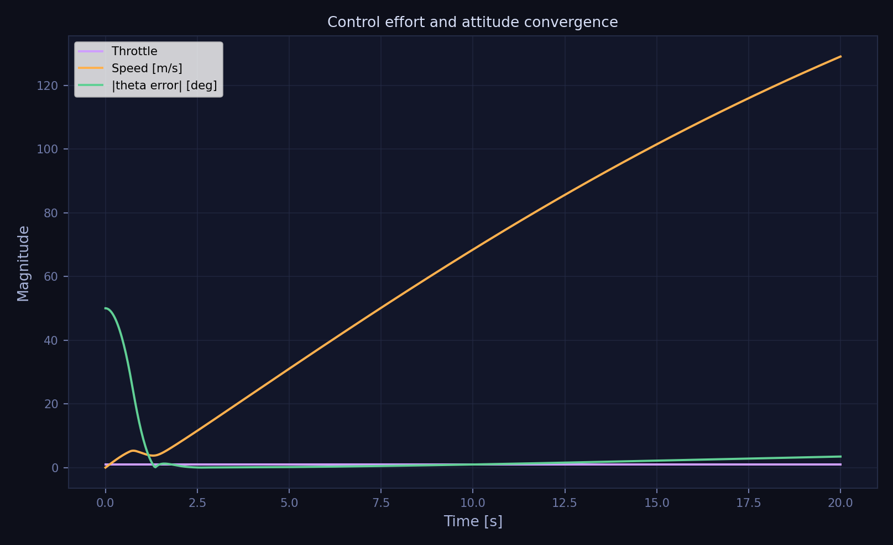

#### Planar trajectory

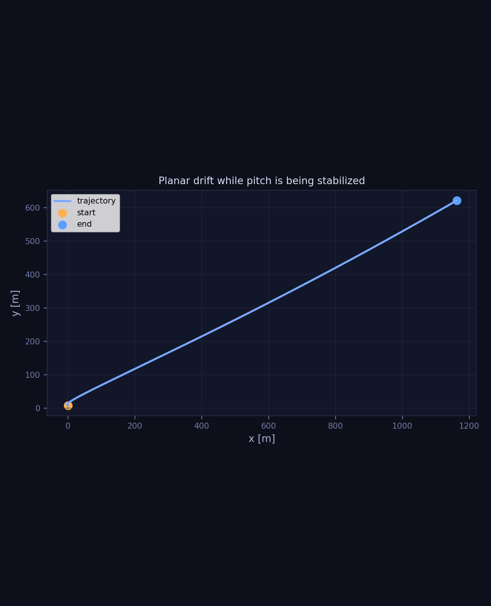

---

### Adaptive controller

#### Animation


#### State trajectories


Bottom panel shows $\hat C_{m\alpha}(t)$ converging toward the true value $1.054$ rad⁻¹ (`final_c_hat = 1.031`, error = −0.023).

#### Attitude and nozzle deflection

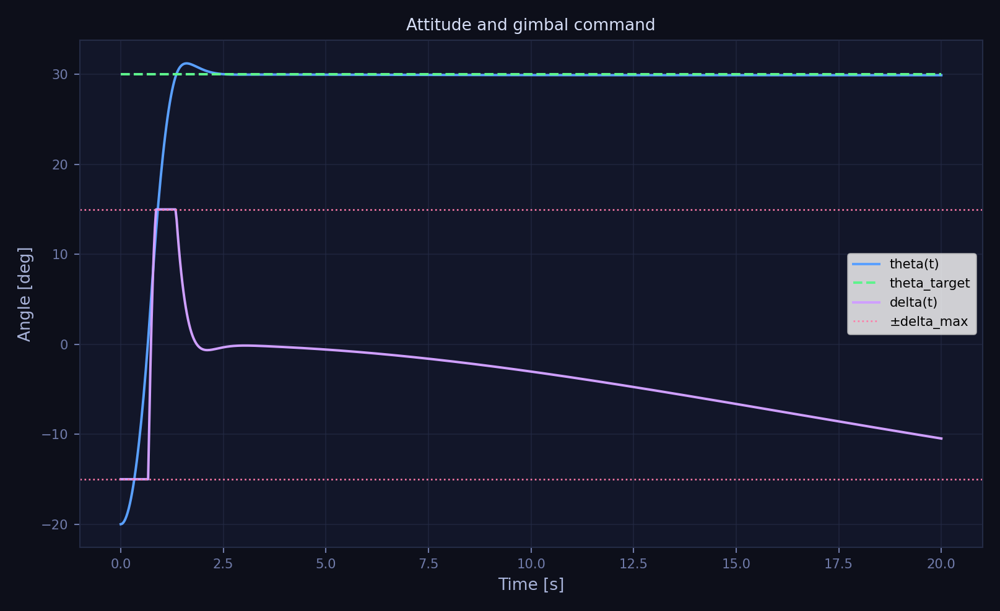

Pitch angle converges to `theta* = 30 deg` (`final_theta = 29.92 deg`). The adaptive compensation cancels the aerodynamic moment, removing the steady-state error present in the baseline.

#### Lyapunov function

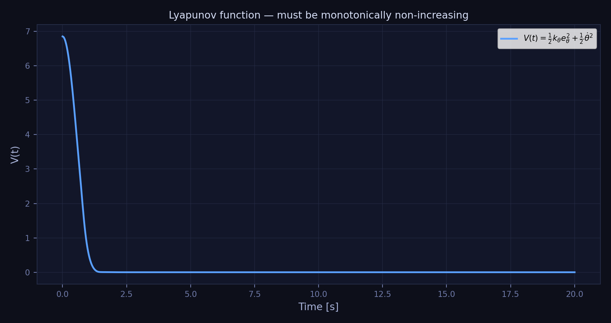

#### Parameter estimation

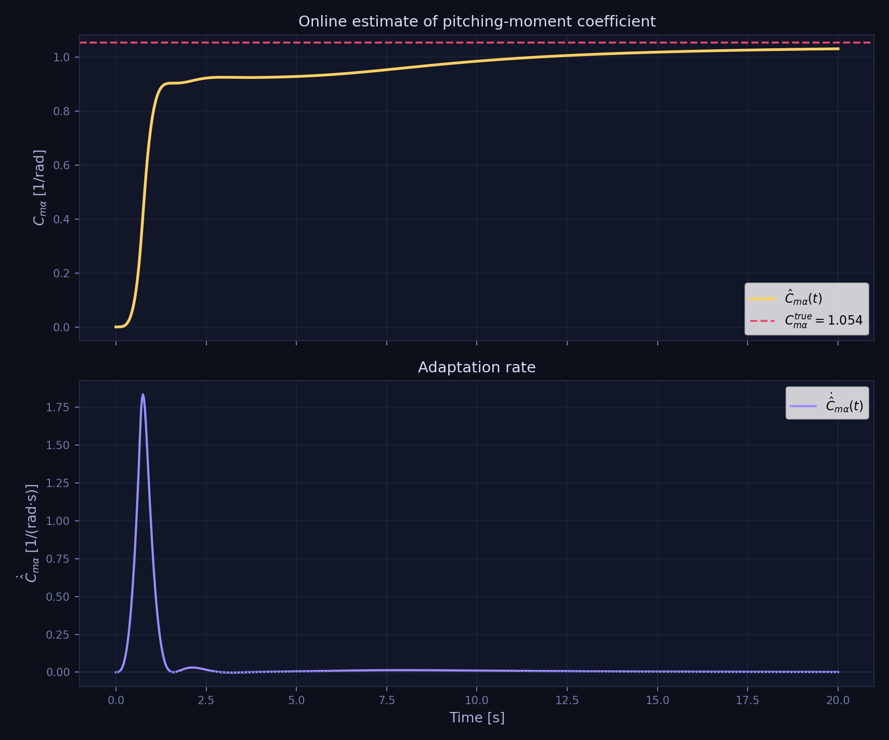

$\hat C_{m\alpha}(t)$ (yellow) converging toward the true value (red dashed). Active adaptation occurs during the attitude transient where $Y(\alpha) \cdot \dot\vartheta \neq 0$.

#### Control and error

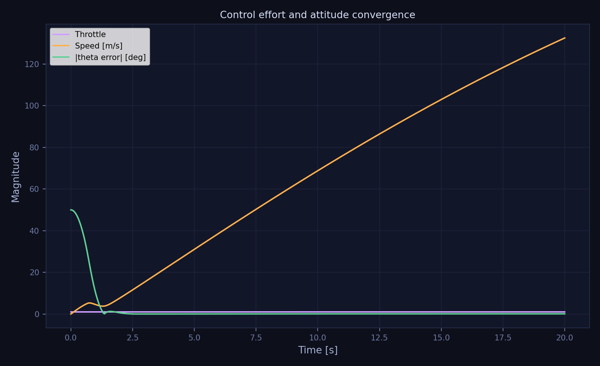

#### Planar trajectory

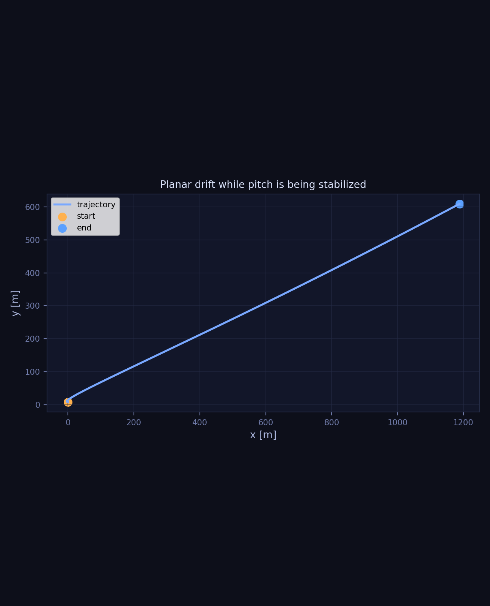

---

### Comparison

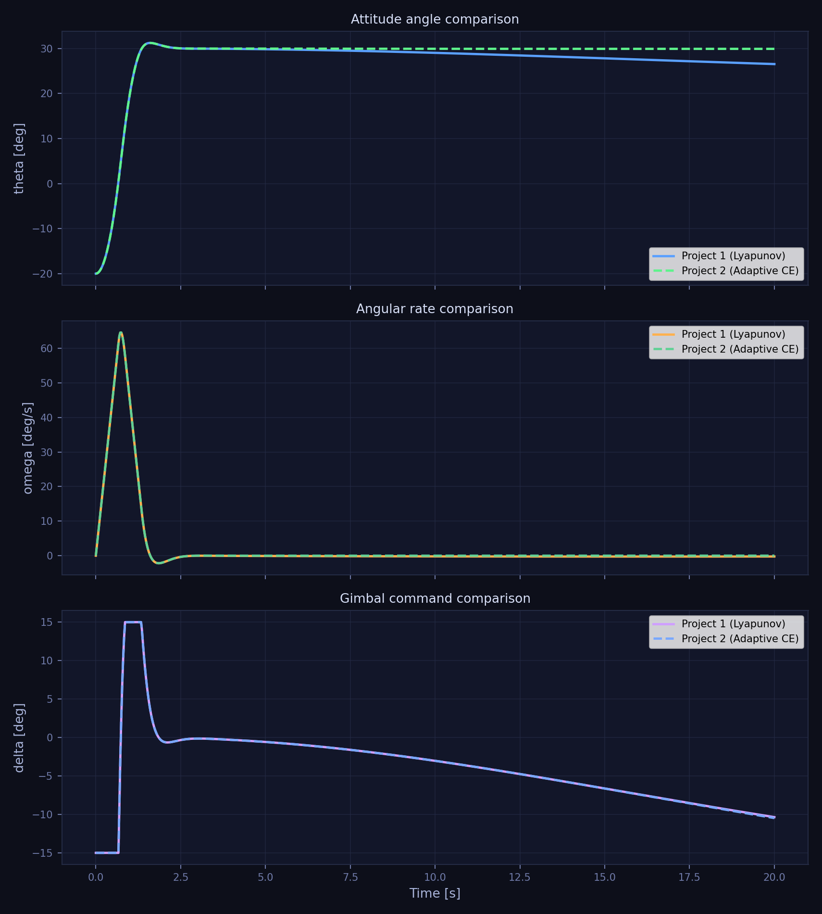

| Metric | Baseline (P1) | Adaptive |
|--------|--------------|-------------|
| Final $\vartheta$ | 26.5 deg | 29.9 deg |
| Final $\dot\vartheta$ | −0.24 deg/s | ≈ 0 deg/s |
| $\hat C_{m\alpha}$ error | −1.054 (fixed at 0) | −0.023 |
| Final speed | 129 m/s | 133 m/s |

The adaptive controller reaches the target angle while the baseline has a **3.4 deg error** due to the uncompensated aerodynamic pitching moment.

---

## 9. Possible Extensions

- **Persistent excitation analysis**: Characterize which initial conditions produce sufficient excitation of $Y(\alpha)\cdot\dot\vartheta$ for parameter convergence.
- **$\gamma$-sweep**: Demonstrate sensitivity of convergence rate and transient quality to the adaptation rate $\gamma$.
- **Cascaded position control (Project 3)**: Add outer loop computing $\vartheta_{\text{des}}$ from position errors; inner adaptive attitude controller tracks $\vartheta_{\text{des}}$.

---

## 10. Notes on AI Use

AI assistance was used to help scaffold code structure, organise documentation, and check mathematical notation consistency. All equations, proofs, and physical interpretations were reviewed and verified by the team before submission.
