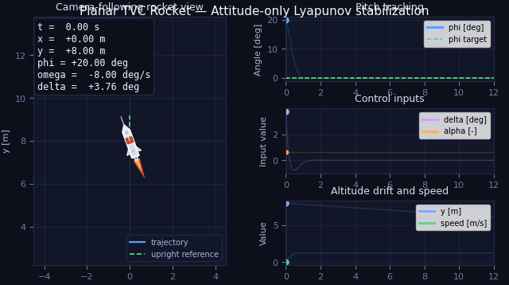

# Project 1 — Planar TVC Rocket with Lyapunov Attitude Control



## Overview
This repository implements a **planar thrust-vector-controlled rocket** with two attitude regulators:
- **Lyapunov attitude controller** (`AttitudeLyapunovController`);
- **cross-term Lyapunov controller** (`CrossTermLyapunovController`).

The simulation pipeline runs both controllers from the same initial condition and generates a direct comparison plot. The control objective is attitude stabilization only:
- **pitch:** $\vartheta$= 0 rad
- **angular rate:** $\omega$ = 0 rad/s

Translational states evolve freely under a fixed hover throttle and are not controlled.

## Quick Start
Create an environment and install the dependencies:

```bash
python -m venv .venv
source .venv/bin/activate
pip install -r requirements.txt
```

Regenerate all figures, the summary file, and the corrected real-time MP4 animation:

```bash
bash run_project.sh
```

Equivalent direct command:

```bash
python -m src.main --config configs/default.yaml --output-root .
```

Generated outputs:
- `figures/state_trajectories.png`
- `figures/attitude_and_gimbal.png`
- `figures/control_and_error.png`
- `figures/planar_trajectory.png`
- `figures/rocket_visualization_preview.png`
- `figures/comparison.png`
- `figures/summary.json`
- `animations/rocket_attitude_realtime.mp4`

## Repository Structure
```text
project_1_lyapunov_control_planar_tvc_rocket/
├── README.md
├── README-derivation-lyapunov.md
├── requirements.txt
├── run_project.sh
├── configs/
│   └── default.yaml
├── src/
│   ├── __init__.py
│   ├── controller.py
│   ├── main.py
│   ├── simulation.py
│   ├── system.py
│   └── visualization.py
├── figures/
│   ├── attitude_and_gimbal.png
│   ├── control_and_error.png
│   ├── planar_trajectory.png
│   ├── rocket_visualization_preview.png
│   ├── state_trajectories.png
│   └── summary.json
└── animations/
    └── rocket_attitude_realtime.mp4
```

## 1. Problem Definition

The control task is to stabilize the pitch angle and angular rate of a planar rocket to zero under gravity and aerodynamic forces, with a nozzle deflection angle limited to $|\delta| \leq \delta_{max}$, and fixed hover throttle. The pitching moment coefficient $C_{m\alpha}$ (see README-Aerodynamics.md) is treated as **unknown to the controller** and is estimated online.

### Method class

The method belongs to **Lyapunov-based adaptive nonlinear control** using the **Certainty Equivalence (CE)** principle: a control law is first designed assuming all parameters are known, then the unknown parameter $C_{m\alpha}$ is replaced with its online estimate $\hat{C}_{m\alpha}(t)$. The adaptation law is derived from an extended Lyapunov function candidate that includes the parameter estimation error, and the gimbal command together with the parameter update rule are jointly chosen to guarantee $\dot{V} \leq 0$.

### Context and assumptions

1. **Constant mass**: Mass is treated as fixed, $\dot{m} = 0$. Consequently inertia moment $\dot{J} = 0$ and $J$ is constant. Exact mass knowledge is assumed.
2. **Aerodynamics included**: Drag, normal force, and pitching moment act on the rocket. The pitching moment coefficient $C_{m\alpha}$ is **unknown to the controller**. The reference value $C_{m\alpha}^{\text{true}} \approx 1.054$ rad$^{-1}$ (from the analytical approximation $m_z(\alpha) = 0.01840\cdot\alpha$) is used in the simulator as ground truth for validation.
3. **Low-speed regime**: The rocket operates at low altitude with standard air density $\rho = 1.225$ kg/m$^3$ and airspeed $V \leq 100$ m/s. In this regime $C_{m\alpha}$ is a true physical constant, justifying its identification as a single scalar parameter.
4. **Translational coefficients known**: $C_x$ and $C_y$ are taken as known constants from the reference data. They affect translational motion only and lie outside the angular control loop addressed in this project.
5. **Attitude-only control**: The control objective is restricted to stabilizing $\vartheta \to \vartheta^{*}$, $\dot{\vartheta} \to 0$. States $(x, y, \dot{x}, \dot{y})$ evolve freely and are not controlled. The throttle is fixed giving constant thrust $F = 1.5 \cdot mg$. Position control is left as a separate project on **backstepping**, since it would introduce unmatched parametric uncertainty.
6. **Full state available**: The state $(x, y, \vartheta, \dot{x}, \dot{y}, \dot{\vartheta})$ is assumed measurable without noise. This allows direct computation of the angle of attack $\alpha$ and the regressor $Y(\alpha)$ used in the adaptation law.

## 2. System Description
### State, control, and notation
The state is

$$
s = [x, y, \vartheta, \dot{x}, \dot{y}, \dot{\vartheta}]^T
$$

where
- $x, y$ — inertial horizontal and vertical position (m)
- $\vartheta$ — pitch angle from the vertical axis, positive rightward (rad)
- $\dot{x}, \dot{y}$ — velocities (m/s)
- $\dot{\vartheta}$ — angular rate (rad/s)

The sole control input is the nozzle deflection angle:

$$
u = \delta
$$

where $\delta$ is the nozzle deflection angle measured from the rocket body axis, with $|\delta| \leq \delta_{max}$.

## System Dynamics

### State and control

$$
q = [x,\ y,\ \vartheta,\ \dot{x},\ \dot{y},\ \dot{\vartheta}]^T, \qquad u = \delta, \quad |\delta| \leq \delta_{max}
$$

with $\vartheta$ measured from the vertical inertial axis to $X_b$ (positive rightward), and $\delta$ measured from $X_b$.

### Auxiliary quantities

$$
v = \sqrt{\dot{x}^2 + \dot{y}^2}, \qquad
q_\infty = \tfrac{1}{2}\rho v^2, \qquad
\alpha = \vartheta - \mathrm{atan2}(\dot{x},\ \dot{y}).
$$

### Aerodynamic forces and moment (body frame)

$$
X_b = -C_x \cdot q_\infty S_m, \qquad
Y_b = C_y(\alpha)\cdot q_\infty S_m, \qquad
M_b^z = C_{m\alpha}\cdot \alpha \cdot q_\infty S_m l.
$$

### Equations of motion

Translational (inertial frame, with $F = 1.5*mg$):

$$
\begin{aligned}
m\ddot{x} &= F\sin(\vartheta+\delta) + X_b\sin\vartheta + Y_b\cos\vartheta, \\
m\ddot{y} &= F\cos(\vartheta+\delta) - mg + X_b\cos\vartheta - Y_b\sin\vartheta.
\end{aligned}
$$

Rotational (about $Z_b$):

$$
J\ddot{\vartheta} = -mg\cdot l_{cp}\sin\delta + q_\infty S_m l \cdot C_{m\alpha} \cdot \alpha
$$

The unknown parameter $C_{m\alpha}$ appears only in the rotational equation — this is the focus of the adaptive controller.

## Control Law Derivation

The control law is derived in two stages: first, an **idealized law** is constructed assuming $C_{m\alpha}$ is known (as in Project 1, but with aerodynamic compensation); second, the **Certainty Equivalence** principle replaces the unknown parameter with its online estimate, and the adaptation law is obtained from an extended Lyapunov function.

### Stage 1 — Idealized law (assuming $C_{m\alpha}$ known)

Define the tracking error:

$$
e_\vartheta = \vartheta - \vartheta_{target}, \qquad \dot{e}_\vartheta = \dot\vartheta.
$$

Take the Lyapunov function candidate:

$$
V_0 = \tfrac{1}{2} k_\vartheta\cdot e_\vartheta^2 + \tfrac{1}{2}\cdot \dot\vartheta^2, \qquad k_\vartheta > 0.
$$

Differentiate along the trajectories of the rotational dynamics:

$$
\dot{V}_0 = k_\vartheta\cdot e_\vartheta\cdot \dot\vartheta + \dot\vartheta\cdot \ddot\vartheta
        = \dot\vartheta\left(k_\vartheta\cdot e_\vartheta + \ddot\vartheta\right).
$$

Substituting the rotational equation $J\ddot\vartheta = -mg\cdot l_{cp}\sin\delta + Y(\alpha) \cdot C_{m\alpha}$, where

$$
Y(\alpha) = q_\infty S_m l \cdot \alpha
$$

is the regressor, gives:

$$
\dot{V}_0 = \dot\vartheta\left(k_\vartheta\cdot e_\vartheta - \frac{mg\cdot l_{cp}}{J}\sin\delta + \frac{Y(\alpha)}{J} C_{m\alpha}\right).
$$

To enforce $\dot{V}_0 = -k_\omega \dot\vartheta^2 \leq 0$ (with $k_\omega > 0$), choose:

$$
\boxed{\sin\delta^* = \frac{J}{mg\cdot l_{cp}}\left(k_\vartheta\cdot e_\vartheta + k_\omega \dot\vartheta + \frac{Y(\alpha)}{J} C_{m\alpha}\right)\;}
$$

This is the idealized law. Compared to Project 1, the additional term $\dfrac{Y(\alpha)}{J} C_{m\alpha}$ **compensates the aerodynamic moment**.

### Stage 2 — Certainty Equivalence

Since $C_{m\alpha}$ is unknown, replace it with the online estimate $\hat{C}_{m\alpha}(t)$:

$$
\boxed{\sin\delta = \frac{J}{mg\cdot l_{cp}}\left(k_\vartheta\cdot e_\vartheta + k_\omega \dot\vartheta + \frac{Y(\alpha)}{J} \hat{C}_{m\alpha}\right)\;}
$$

This is the realizable control law. The estimate $\hat{C}_{m\alpha}(t)$ must be updated online — the update law is derived next.

### Stage 3 — Adaptation law via extended Lyapunov function

Define the parameter estimation error:

$$
\tilde{\theta} = \hat{C}_{m\alpha} - C_{m\alpha}, \qquad \dot{\tilde\theta} = \dot{\hat{C}}_{m\alpha} \quad (\text{since } C_{m\alpha} \text{ is constant}).
$$

Extend the Lyapunov function with a quadratic penalty on the estimation error:

$$
V = \tfrac{1}{2} k_\vartheta\cdot e_\vartheta^2 + \tfrac{1}{2}\cdot \dot\vartheta^2 + \tfrac{1}{2\gamma}\cdot \tilde\theta^2, \qquad \gamma > 0.
$$

Substituting the realizable law into the rotational dynamics yields the closed-loop angular acceleration:

$$
\ddot\vartheta = -k_\vartheta\cdot e_\vartheta - k_\omega\cdot \dot\vartheta - \frac{Y(\alpha)}{J}\cdot \tilde\theta.
$$

Differentiating $V$ along the closed-loop trajectories:

$$
\dot{V} = -k_\omega\cdot \dot\vartheta^2 + \tilde\theta \left(\frac{\dot{\hat{C}}_{m\alpha}}{\gamma} - \frac{Y(\alpha)\cdot \dot\vartheta}{J}\right).
$$

To eliminate the indefinite term and ensure $\dot V \leq 0$, choose the **adaptation law**:

$$
\boxed{\dot{\hat{C}}_{m\alpha} = \gamma \cdot \frac{Y(\alpha) \cdot \dot\vartheta}{J}\;}
$$

With this choice:

$$
\dot V = -k_\omega\cdot \dot\vartheta^2 \leq 0.
$$

### Stability guarantees

From $\dot V \leq 0$ it follows that $V$ is bounded, hence $e_\vartheta$, $\dot\vartheta$, and $\tilde\theta$ all remain **bounded**. By Barbalat's lemma, $\dot\vartheta \to 0$ and consequently $e_\vartheta \to 0$ as $t \to \infty$ — the rocket stabilizes at the target attitude.

The estimation error $\tilde\theta$ remains bounded but does **not** in general converge to zero. Convergence $\hat{C}_{m\alpha} \to C_{m\alpha}$ requires the regressor $Y(\alpha)$ to be **persistently exciting** — a standard condition in adaptive control theory.

### Projection (practical safeguard)

To prevent the estimate from drifting outside physically meaningful bounds, the adaptation is augmented with a projection operator:

$$
\dot{\hat{C}}_{m\alpha} =
\begin{cases}
\gamma \cdot \dfrac{Y(\alpha)\cdot \dot\vartheta}{J}, & \text{if } \hat{C}_{m\alpha} \in [\theta_{min},\ \theta_{max}], \\
0, & \text{otherwise (when adaptation would push beyond bounds)}.
\end{cases}
$$

Bounds are chosen to bracket the reference value: e.g. $[\theta_{min},\ \theta_{max}] = [0.1,\ 5.0]$ rad$^{-1}$ for a positive pitching moment coefficient.

## 4. Method Description
### Control pipeline
At every integration step the code performs the following pipeline:
1. read the current state `(x, y, phi, vx, vy, omega, mass)`;
2. compute the attitude error `e_phi = phi`;
3. compute the nozzle deflection angle `delta` from the Lyapunov attitude law;
4. propagate the nonlinear dynamics with `solve_ivp`;
5. post-process the state history into plots, an animation, and summary metrics.

### Why the controller works in practice
The Lyapunov attitude law drives `phi` and `omega` to zero by construction — $\dot{V} \leq 0$ is guaranteed for all $k_\vartheta > 0$, $k_\omega > 0$. Translational states evolve freely under the fixed hover throttle.

## 5. Experimental Setup
### Initial condition
- `x(0) = 0.0 m`
- `y(0) = 8.0 m`
- `phi(0) = 20.0 deg`
- `vx(0) = 0.0 m/s`
- `vy(0) = 0.0 m/s`
- `omega(0) = -8.0 deg/s`
- `m = 1.60 kg` (constant)

### Target state
- `phi_target = 0.0 rad`
- `omega_target = 0.0 rad/s`

Translational states are not controlled — position and velocity evolve freely.

### Physical parameters
- `g = 9.81 m/s^2`
- `mass = 1.60 kg`
- `F_max = 24.0 N`
- `J_const = 0.1183 kg m^2`
- `l_cp = 0.6091 m`
- `delta_max = 15 deg`

### Controller gains (Lyapunov attitude controller)
- `k_phi = 18.0`
- `k_omega = 7.0`
- `phi_target_deg = 0.0`

### Controller gains (cross-term Lyapunov)
- `k_phi = 25.0`
- `k_omega = 10.0`
- `k_c = 7.0`
- `c = 0.2`
- `phi_target_deg = 0.0`

### Numerical setup
- final simulation time: `5.0 s`
- sample count: `721`
- integrator: `scipy.integrate.solve_ivp`
- integrator max step: `0.02 s`

## 6. Reproducibility
The repository includes exact commands, a dependency file, and a deterministic default configuration.

### Reproduce the final outputs
From the repository root, run:

```bash
python -m venv .venv
source .venv/bin/activate
pip install -r requirements.txt
python -m src.main --config configs/default.yaml --output-root .
```

### What each module does
- `src/system.py` defines the rocket parameters and nonlinear right-hand side;
- `src/controller.py` implements two attitude regulators: `AttitudeLyapunovController` and `CrossTermLyapunovController`;
- `src/simulation.py` integrates the system and provides `simulate` (Lyapunov attitude) plus `simulate_both` (Lyapunov attitude + cross-term);
- `src/visualization.py` generates all figures, including `comparison.png`, and the corrected real-time MP4 animation;
- `src/main.py` runs both regulators and writes a combined `figures/summary.json` (`pd`, `cross_term`, `comparison`).

## 7. Results Summary
Both regulators converge in attitude (`phi -> 0`, `omega -> 0`) in the default experiment. The cross-term regulator reduces peak gimbal demand but increases translational speed and drift compared with the Lyapunov attitude controller.

### Quantitative results
- **Lyapunov attitude controller**
  - final position: `(4.286100220018184, 7.317845231040285) m`
  - final pitch: `-9.289540202597493e-08 deg`
  - final angular rate: `2.6765738366331744e-06 deg/s`
  - final speed: `0.8828260180662892 m/s`
  - max absolute gimbal: `5.50247288376789 deg`
  - max speed: `0.9787758492524684 m/s`
- **Cross-term controller**
  - final position: `(7.218912011175233, 7.153153571277549) m`
  - final pitch: `4.8792597768221715e-06 deg`
  - final angular rate: `-1.911513020195674e-05 deg/s`
  - final speed: `1.5609724965023237 m/s`
  - max absolute gimbal: `2.6852208077477684 deg`
  - max speed: `1.5609724965023237 m/s`
- **Difference (cross-term − Lyapunov attitude)**
  - `final_phi_deg_diff = 4.972155178848146e-06`
  - `final_omega_deg_s_diff = -2.1791704038589914e-05`
  - `max_abs_delta_deg_diff = -2.8172520760201216 deg`
  - `max_speed_diff = 0.5821966472498553 m/s`

### What works
- Both regulators stabilize attitude and angular rate to near-zero.
- The cross-term regulator decreases peak gimbal demand compared with the Lyapunov attitude controller.
- The comparison pipeline is reproducible via one command and saves both plot and numeric comparison.
- The exported MP4 now matches the physical simulation time instead of playing too fast.

### Alternative regulator (cross-term)
- Lyapunov function:
  - `V = 0.5*k_phi*e_phi^2 + 0.5*omega^2 + c*e_phi*omega`
- Control law:
  - `numerator = k_phi*e_phi*omega + (c + k_omega)*omega^2 + k_c*e_phi^2`
  - `denominator = omega + c*e_phi`
  - `sin(delta) = (J / (alpha * F_max * l_cp)) * (numerator / denominator)`
- Singularity protection in code:
  - if `|denominator| < eps`, fallback to Lyapunov attitude law.
- Practical interpretation for current tuning:
  - smoother actuator demand (`|delta|` peak lower),
  - weaker translational performance (`max_speed` and drift higher).

### Cross-term sweep summary
The repository includes a gain sweep report generated from `figures/crossterm_sweep_phi01_compact.json` with threshold `|phi| < 0.1 rad`.

| Metric | Value |
|---|---|
| Input cases | 36 |
| Converged cases | 6 |
| Non-converged cases | 30 |
| Fixed gains during sweep | `k_phi=25`, `k_omega=10` |
| Swept gains | `k_c in [0,5]`, `c in [0.2,2.2]` |

Top converged settings by persistent settling time:

| Rank | `k_c` | `c` | First entry [s] | Settling [s] | Max abs delta [deg] | Max speed [m/s] |
|---:|---:|---:|---:|---:|---:|---:|
| 1 | 0 | 0.2 | 0.4861 | 0.4861 | 10.4117 | 1.2931 |
| 2 | 1 | 0.2 | 0.4931 | 0.4931 | 9.1560 | 1.3194 |
| 3 | 2 | 0.2 | 0.5069 | 0.5069 | 7.9048 | 1.3480 |
| 4 | 3 | 0.2 | 0.5139 | 0.5139 | 6.6573 | 1.3796 |
| 5 | 4 | 0.2 | 0.5278 | 0.5278 | 5.4130 | 1.4148 |
| 6 | 5 | 0.2 | 0.5417 | 0.5417 | 4.1712 | 1.4549 |

Analysis:
- Convergence is highly concentrated in a narrow band of `c` (here only `c=0.2` converged in the tested grid).
- Small changes in `c` can move the system from fast convergence to complete non-convergence over the simulation horizon.
- Increasing `k_c` in the converged band reduces peak gimbal demand, but also tends to increase translational speed.

Conclusion:
- The cross-term regulator is significantly more sensitive to tuning than the Lyapunov attitude controller in this project setup.
- It can provide smoother actuator behavior, but practical tuning is difficult and requires careful grid search with explicit convergence checks.

### What remains limited
- The inertia and control moment arm are frozen at midpoint mass.
- Rotational drag, actuator dynamics, and sensor noise are omitted.
- The proof is quasi-static with respect to mass variation.
- Comparison currently uses one scenario (single initial condition and one gain set).

## 8. Figures and Interpretation
### State trajectories

Pitch angle and angular rate converge to zero from the initial condition without persistent oscillation.

### Attitude and gimbal command

Pitch and angular rate converge to zero, while the gimbal command remains far below the hard `15 deg` limit.

### Control effort

The nozzle deflection angle and angular rate decay smoothly — the closed-loop system settles without chattering.

### Planar trajectory

The planar path shows the rocket's free translational motion during attitude stabilization.

### Lyapunov attitude vs cross-term comparison

Both controllers on the same axes. The cross-term controller exhibits lower peak gimbal demand than the Lyapunov attitude controller.

## 9. Animation
The project includes a corrected real-time animation:
- `animations/rocket_attitude_realtime.mp4`

The animation shows the rocket body, its current orientation, the nozzle deflection angle, the angular rate, and the current time.

## 10. Possible Extensions
- **Translational drag**: add drag forces $-\frac{\beta}{m}\dot{x}$ and $-\frac{\beta}{m}\dot{y}$ to the equations of motion and re-derive the stability analysis under dissipation.
- **Variable mass and inertia**: replace constant $m$, $J$, $l_{cp}$ with time-varying quantities updated from the fuel depletion model; extend the Lyapunov proof to the time-varying case.
- **Cascaded position control**: add an outer loop that computes a desired pitch angle $\vartheta_{des}$ from position errors $(e_x, e_y)$, feeding it as a reference to the inner attitude controller — enabling full $(x, y, \vartheta)$ stabilization.

## 11. Notes on AI Use
AI assistance was used to help scaffold code, restructure files, and polish the documentation and visualisation. The final equations, parameters, and interpretation of the plots should still be checked by the team before submission.
