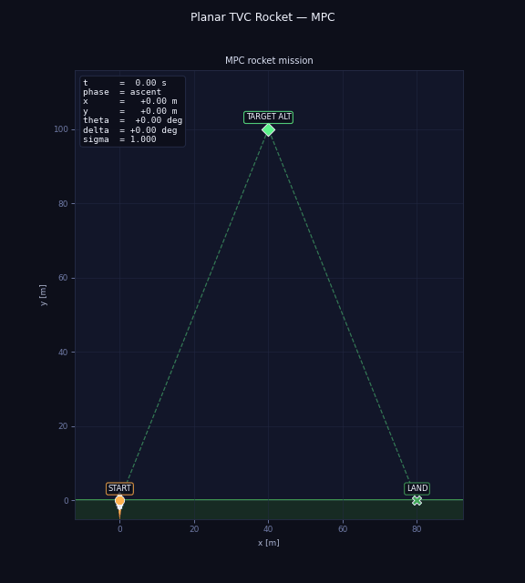
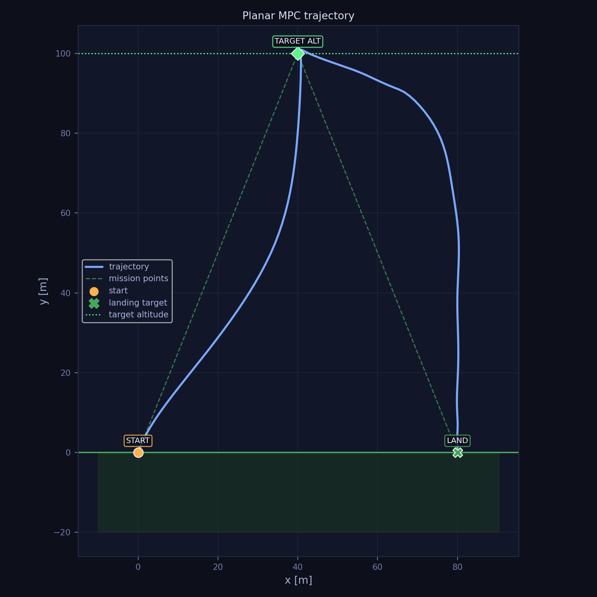
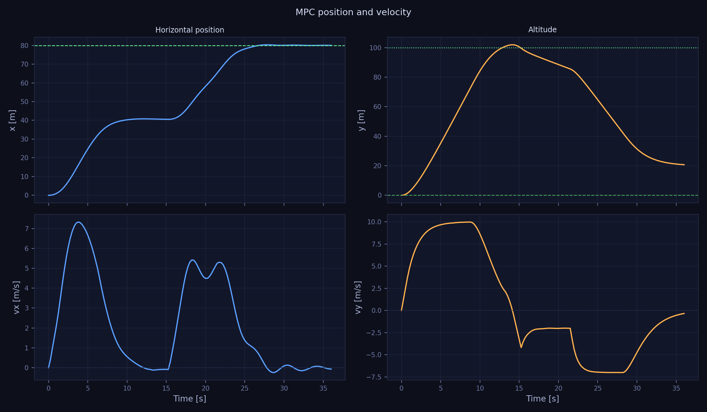
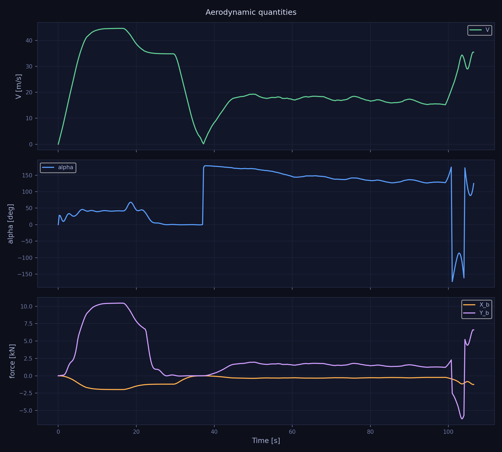
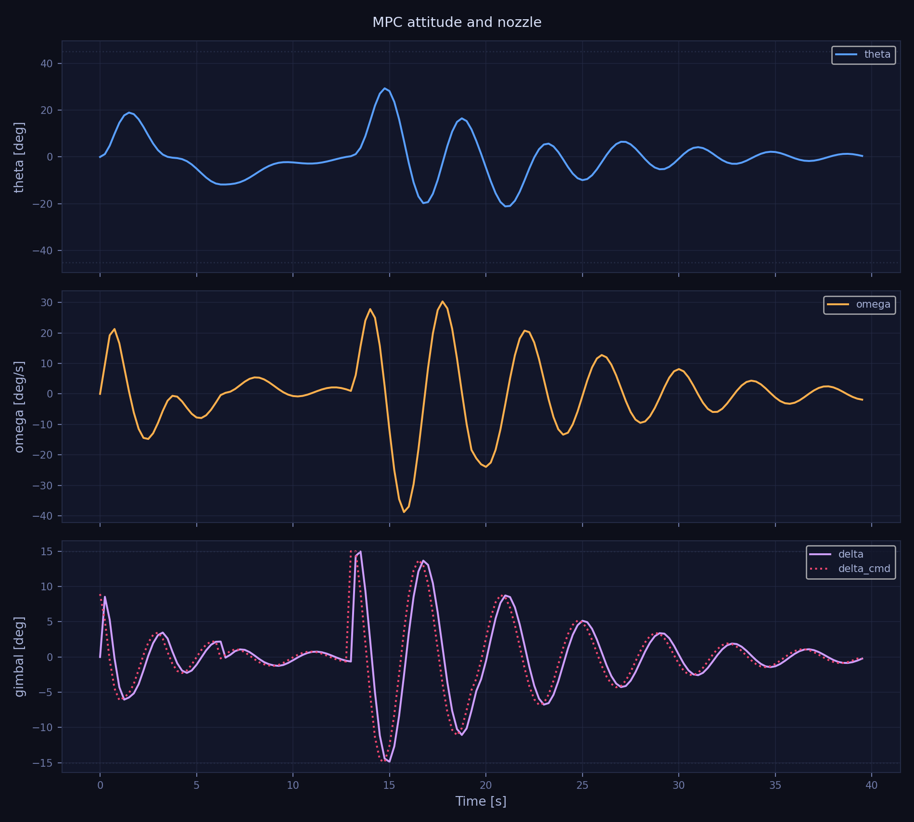
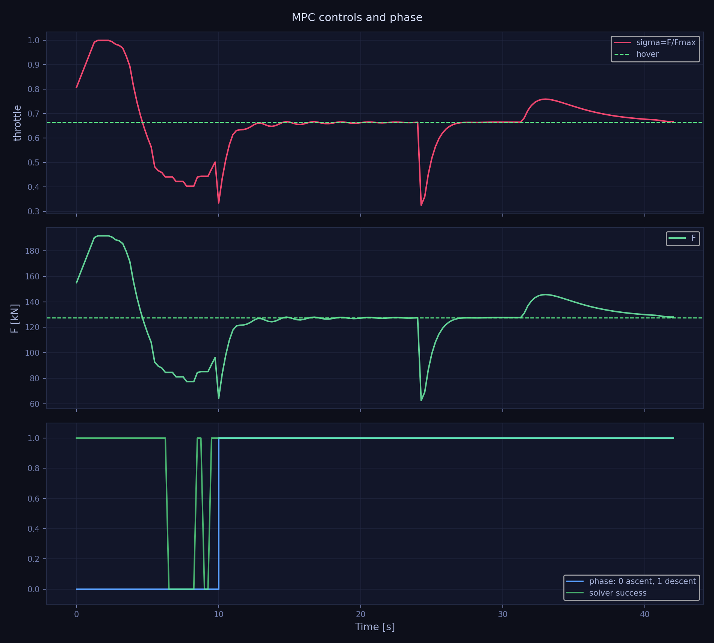

# Planar TVC Rocket — Model Predictive Control



## Overview

This repository implements a **planar thrust-vector-controlled (TVC) rocket** steered by a nonlinear **Model Predictive Controller (MPC)**.

### What is TVC?

Thrust-vector control means the rocket steers itself by tilting its engine nozzle. There are no aerodynamic control surfaces — attitude and trajectory are controlled entirely by redirecting the thrust vector. This makes TVC a common choice for rockets that must operate across a wide speed range, including near-zero velocity during landing.

### What is MPC?

Model Predictive Control is an optimization-based control strategy. At every time step, the controller:

1. takes the current rocket state as input,
2. uses an internal model of the rocket dynamics to simulate possible future trajectories,
3. finds the sequence of control inputs that minimizes a cost function over a finite prediction horizon,
4. applies only the first control input, then repeats the process at the next step.

This receding-horizon approach allows the controller to anticipate future behavior and respect constraints on actuators and states, without requiring a manually designed reference trajectory.

### Mission

The rocket is given only high-level mission objectives — no reference trajectory is prescribed:

1. lift off from the ground,
2. reach a target altitude $h_{\mathrm{target}}$,
3. return and land softly at a specified horizontal coordinate $x_{\mathrm{land}}$.

The full flight path is generated automatically by the optimizer as a result of solving the optimal control problem at each step.

### Control Objective

The mission is split into two sequential phases, each with its own target:

**Ascent** — climb to the target altitude while stabilizing attitude and reducing vertical velocity:

$$
[x,\ y,\ \dot x,\ \dot y,\ \vartheta,\ \dot\vartheta,\ \delta]^T
\;\longrightarrow\;
[x_{\mathrm{land}}/2,\ h_{\mathrm{target}},\ \ast,\ 0,\ 0,\ 0,\ \ast]^T
$$

**Descent** — translate to the landing site and touch down with near-zero velocity and near-vertical attitude:

$$
[x,\ y,\ \dot x,\ \dot y,\ \vartheta,\ \dot\vartheta,\ \delta]^T
\;\longrightarrow\;
[x_{\mathrm{land}},\ 0,\ 0,\ 0,\ 0,\ 0,\ 0]^T
$$

The symbol $\ast$ denotes state components that are left free during ascent (zero terminal weight assigned).

Both phases are controlled using the same two inputs:

$$
u = [\delta_{\mathrm{cmd}},\ F]^T
$$

where $\delta_{\mathrm{cmd}}$ is the commanded nozzle deflection angle and $F$ is the thrust magnitude.

---

## Quick Start

```bash
python -m venv .venv
source .venv/bin/activate
pip install -r requirements.txt

# Main MPC simulation
python -m src.main --config configs/mpc.yaml --output-root outputs/mpc

# Main MPC simulation with GIF animation
python -m src.main --config configs/mpc.yaml --output-root outputs/mpc --animate

# Faster test configuration
python -m src.main --config configs/mpc_fast.yaml --output-root outputs/mpc_fast
```

On Linux/macOS, the helper script can also be used:

```bash
chmod +x run_project.sh
./run_project.sh
```

With animation:

```bash
./run_project.sh --animate
```

---

## Repository Structure

```text
rocket_hover_energy_based/
├── configs/
│   ├── mpc.yaml              # Main MPC configuration
│   └── mpc_fast.yaml         # Faster test configuration
├── docs/
│   ├── rocket_mpc_v2.pdf     # MPC problem statement
│   └── aerodynamics.pdf      # Aerodynamic coefficient derivation
├── src/
│   ├── system.py             # 7-state rocket dynamics and aerodynamics
│   ├── mpc_controller.py     # MPC controller and terminal landing assist
│   ├── simulation.py         # Simulation loop, mission phases, touchdown logic
│   ├── visualization.py      # Diagnostic plots and GIF animation
│   └── main.py               # CLI entry point
├── outputs/
│   ├── mpc/
│   │   ├── figures/
│   │   └── animations/
│   └── mpc_fast/
│       └── figures/
├── requirements.txt
├── run_project.sh
└── README.md
```

---

## 1. Problem Definition

The mission is a two-phase flight of a planar TVC rocket.

The rocket starts from the ground, rises to a target altitude $h_{\mathrm{target}}$, and then lands at a specified horizontal coordinate $x_{\mathrm{land}}$.

Unlike tracking control, no full reference trajectory is prescribed. The controller must find a dynamically feasible trajectory using only:

- current state,
- rocket dynamics,
- actuator limits,
- mission phase,
- terminal target.

### Mission Phases

| Phase | Objective |
|------|-----------|
| `ascent` | Reach target altitude $h_{\mathrm{target}}$ with small vertical velocity |
| `descent` | Land at $x_{\mathrm{land}}$ with near-zero velocity and attitude |

The phase switch occurs when the rocket is close to the target altitude and the vertical velocity is sufficiently small.

The touchdown condition requires the rocket to be close to the landing point and have small velocity, attitude, and angular rate.

---

## 2. System Description

### State Vector

The plant state is:

$$
s =
[x,\ y,\ \dot x,\ \dot y,\ \vartheta,\ \dot\vartheta,\ \delta]^T
\in \mathbb{R}^7
$$

where:

| State | Meaning | Units |
|------|---------|-------|
| $x$ | Horizontal position of the center of mass | m |
| $y$ | Altitude of the center of mass | m |
| $\dot x$ | Horizontal velocity | m/s |
| $\dot y$ | Vertical velocity | m/s |
| $\vartheta$ | Pitch angle from vertical, positive rightward | rad |
| $\dot\vartheta$ | Pitch angular velocity | rad/s |
| $\delta$ | Current nozzle deflection | rad |

### Control Vector

The MPC directly optimizes:

$$
u =
[\delta_{\mathrm{cmd}},\ F]^T
\in \mathbb{R}^2
$$

| Input | Meaning | Units |
|------|---------|-------|
| $\delta_{\mathrm{cmd}}$ | Commanded nozzle deflection | rad |
| $F$ | Thrust magnitude | N |

---

## 3. Equations of Motion

The rocket model uses a small-nozzle-deflection linearization.

### Translational Dynamics

The horizontal and vertical translational dynamics are:

$$
m\ddot{x} = F\sin\vartheta + F\delta\cos\vartheta + X_b\sin\vartheta + Y_b\cos\vartheta
$$

$$
m\ddot{y} = F\cos\vartheta - mg - F\delta\sin\vartheta + X_b\cos\vartheta - Y_b\sin\vartheta
$$

Equivalently, the accelerations can be written as:

$$
\ddot{x} = \frac{F\sin\vartheta + F\delta\cos\vartheta + X_b\sin\vartheta + Y_b\cos\vartheta}{m}
$$

$$
\ddot{y} = \frac{F\cos\vartheta - mg - F\delta\sin\vartheta + X_b\cos\vartheta - Y_b\sin\vartheta}{m}
$$

### Rotational Dynamics

The rotational dynamics are:

$$
J\ddot{\vartheta} = F l_{cp}\delta + M_b
$$

or equivalently:

$$
\ddot{\vartheta} = \frac{F l_{cp}\delta + M_b}{J}
$$

### Nozzle Actuator

The nozzle actuator is modeled as a first-order system:

$$
\tau_\delta \dot{\delta} = -\delta + \delta_{\mathrm{cmd}}
$$

The simulator integrates the nonlinear dynamics with an RK4 step.

---

## 4. Aerodynamic Model

The rocket experiences three body-frame aerodynamic quantities:

$$
X_b = -C_x(M) q_\infty S_m
$$

$$
Y_b = C_y(\alpha, V) q_\infty S_m
$$

$$
M_b = m_z(\alpha, V) q_\infty S_m l
$$

where:

$$
q_\infty = \frac{1}{2}\rho V^2
$$

The normal force coefficient is modeled as:

$$
C_y(\alpha) =
\begin{cases}
0.05403\alpha, & V \in [0, 500]\ \mathrm{m/s} \\
0.02599\alpha + 0.008257\alpha^2, & V \in [500, 2200]\ \mathrm{m/s}
\end{cases}
$$

The pitching moment coefficient is modeled as:

$$
m_z(\alpha) =
\begin{cases}
0.01840\alpha, & V \in [0, 500]\ \mathrm{m/s} \\
0.02113\alpha - 0.0006463\alpha^2, & V \in [500, 2200]\ \mathrm{m/s}
\end{cases}
$$

---

## 5. MPC Formulation

At every simulation step, the controller solves a finite-horizon optimal control problem.

The discrete dynamics are:

$$
s_{k+1} = f_d(s_k, u_k)
$$

where $f_d$ is obtained by numerical integration of the nonlinear rocket dynamics using a 4th-order Runge–Kutta (RK4) scheme with fixed time step $\Delta t$.

### Cost Function

The cost function consists of a stage cost on control effort and a terminal penalty on the final state of the horizon:

$$
J =
\sum_{k=0}^{N-1}
\left[
R_\delta \delta_{\mathrm{cmd},k}^2
+
R_F(F_k - F_{\mathrm{hover}})^2
\right]
+
(s_N - s_{\mathrm{target}})^T
P
(s_N - s_{\mathrm{target}})
$$

where:

$$
F_{\mathrm{hover}} = mg
$$

**Arguments of the cost function:**

| Symbol | Type | Meaning |
|--------|------|---------|
| $N$ | scalar | Prediction horizon length — number of discrete steps over which the optimizer plans ahead |
| $k$ | scalar | Step index along the horizon, $k = 0, 1, \ldots, N-1$ |
| $\delta_{\mathrm{cmd},k}$ | scalar | Commanded nozzle deflection at step $k$; penalized to keep nozzle excursions small |
| $R_\delta$ | scalar | Positive weight on nozzle deflection; larger values reduce nozzle activity |
| $F_k$ | scalar | Thrust magnitude at step $k$ |
| $F_{\mathrm{hover}}$ | scalar | Hover thrust $mg$; the stage cost penalizes deviation from this reference, not from zero, so the optimizer is biased toward fuel-efficient flight rather than minimum thrust |
| $R_F$ | scalar | Positive weight on thrust deviation from hover; larger values keep thrust close to $mg$ |
| $s_N$ | $\mathbb{R}^7$ | Predicted state at the end of the horizon (step $N$) |
| $s_{\mathrm{target}}$ | $\mathbb{R}^7$ | Target state for the current mission phase (see Section 6) |
| $P$ | $\mathbb{R}^{7 \times 7}$ | Positive semi-definite terminal weight matrix; diagonal entries select which state components are penalized and with what strength |

The **stage cost** (sum over $k$) penalizes control effort at every step along the horizon.

The **terminal cost** (quadratic in $s_N - s_{\mathrm{target}}$) penalizes the deviation of the predicted final state from the mission target. Since only the terminal state is penalized — not intermediate states — the optimizer has freedom to choose any dynamically feasible path to reach the target, rather than tracking a fixed reference trajectory.

> **Note:** The expression under the sum is not fixed — it can be adapted to the mission requirements. For example, a fuel-optimal mission may include $\sum F_k$ to directly minimize propellant consumption; a trajectory-tracking mission may add a state-error term $\|(s_k - s_{\mathrm{ref},k})\|_Q^2$ to follow a prescribed path at each step; a smooth-control mission may penalize control increments $\|\Delta u_k\|^2$ instead of absolute values. The current formulation uses pure control-effort penalization, which is appropriate for free-trajectory optimization where only the terminal target matters.
### Influence of Weights on the Trajectory

The weights $R_\delta$, $R_F$, and $P$ directly shape the trajectory that the optimizer produces. Their balance determines how aggressively the rocket pursues the target versus how conservatively it uses its actuators.

| Weight | Effect when increased | Effect when decreased |
|--------|----------------------|----------------------|
| $R_\delta$ | Nozzle deflections become smaller and slower; attitude corrections are gentler, trajectory is smoother but may deviate more | Nozzle is used more freely; tighter attitude control, faster corrections |
| $R_F$ | Thrust stays close to hover thrust $mg$; trajectory is more fuel-efficient but less aggressive | Thrust variations are larger; optimizer exploits full thrust range for faster target approach |
| $P$ (diagonal entries) | Terminal state is pulled strongly toward the target; trajectory bends earlier to meet the endpoint | Optimizer treats the terminal target loosely; trajectory may end far from the desired state |

The weights compete: a large $P$ drives the rocket toward the target, while large $R_\delta$ and $R_F$ resist the actuator effort needed to get there. The resulting trajectory is the optimizer's compromise between these conflicting objectives.

In practice, tuning these weights is the primary way to adjust the flight profile — for example, increasing $P_{yy}$ (altitude weight) during ascent makes the rocket prioritize reaching $h_{\mathrm{target}}$ more directly, while increasing $R_F$ produces a more fuel-efficient arc.
### Why There Is No Tracking Trajectory

The MPC does not penalize deviation from a full reference trajectory at every step.

Instead, only the terminal state is penalized. This allows the rocket to find its own trajectory rather than being forced to follow a manually designed path.

This is the key idea of the project: the trajectory is a result of optimization, not an input to the controller.

---

## 6. Mission Targets

### Ascent Phase

During ascent, the target only fixes the altitude and selected stability-related components:

$$
s_{\mathrm{target,ascent}} =
\begin{bmatrix}
x_{land}/2 \\
h_{\mathrm{target}} \\
\ast \\
0 \\
0 \\
0 \\
\ast
\end{bmatrix}
$$

The symbols $\ast$ indicate components that are intentionally left free by assigning zero terminal weights.


### Descent Phase

During descent, the landing target is fully specified:

$$
s_{\mathrm{target,descent}} =
\begin{bmatrix}
x_{\mathrm{land}} \\
0 \\
0 \\
0 \\
0 \\
0 \\
0
\end{bmatrix}
$$

The terminal weights in descent strongly penalize:

- landing position error,
- horizontal velocity,
- vertical velocity,
- pitch angle,
- angular velocity.
---

## 7. Constraints

The controller respects physical and actuator limits.

### Control Constraints

$$
|\delta_{\mathrm{cmd}}| \leq \delta_{\mathrm{cmd,max}}
$$

$$
F_{\min} \leq F \leq F_{\max}
$$

### State Constraints

The simulation and controller penalize or limit:

$$
|\vartheta| \leq \vartheta_{\max}
$$

$$
|\delta| \leq \delta_{\max}
$$

$$
y \geq 0
$$

$$
V \leq 50\ \mathrm{m/s}
$$

In the current implementation, control bounds are enforced directly by the optimizer, while some state limits are handled with soft penalties for numerical robustness.

A key advantage of MPC is its natural ability to handle various types of phase constraints. Since MPC generates control actions by solving an optimization problem at each step, constraints on state and control variables — including phase-dependent limits and conditional bounds — are incorporated directly into the problem formulation, making them straightforward to enforce without requiring separate constraint-handling logic.

---

## 8. Implementation Details

The current implementation uses a practical single-shooting nonlinear MPC formulation.

At each step:

1. the current state is measured,
2. the active mission phase is selected,
3. the MPC optimizes a sequence of future controls,
4. only the first control input is applied,
5. the rocket state is advanced using RK4,
6. the optimized sequence is shifted forward and used as a warm start.

### Solver

The controller uses `scipy.optimize` for the nonlinear finite-horizon optimization.

This keeps the project lightweight and easy to run without requiring CasADi, IPOPT, or ACADOS.

### Terminal Landing Assist

The default configuration includes a terminal landing assist during the final descent phase.

This improves touchdown quality and prevents the single-shooting solver from producing unstable or sideways touchdown behavior near the ground.

It can be disabled in the configuration:

```yaml
controller:
  assist_override_descent: false
```

With this option disabled, the project runs a more purely MPC-based descent, but touchdown quality may be worse unless the weights and horizon are further tuned.

---

## 9. Experimental Setup

### Mission Parameters

The mission consists of three key waypoints:

**Launch point** — initial position on the ground:

| Parameter | Value | Description |
|----------|------:|-------------|
| $x_{\mathrm{start}}$ | 0.0 m | Horizontal launch position |
| $y_{\mathrm{start}}$ | 0.0 m | Ground level |

**Intermediate waypoint** — target apex reached at the end of the ascent phase:

| Parameter | Value | Description |
|----------|------:|-------------|
| $x_{\mathrm{target}}$ | 500.0 m | Horizontal position at apex (midpoint between launch and landing) |
| $y_{\mathrm{target}}$ | 1000.0 m | Target altitude $h_{\mathrm{target}}$ |

**Landing point** — final destination reached at the end of the descent phase:

| Parameter | Value | Description |
|----------|------:|-------------|
| $x_{\mathrm{land}}$ | 1000.0 m | Horizontal landing coordinate |
| $y_{\mathrm{land}}$ | 0.0 m | Ground level |

### Physical Parameters

| Parameter | Value |
|----------|------:|
| $m$ | 13 000 kg |
| $J$ | 318 196 kg·m² |
| $g$ | 9.81 m/s² |
| $l_{cp}$ | 10.3 m |
| $l$ | 18.0 m |
| $\rho$ | 1.225 kg/m³ |
| $S_m$ | 4.5216 m² |
| $F_{\max}$ | 191 763 N |
| $\delta_{\max}$ | 15 deg |

### MPC Parameters

| Parameter | Meaning |
|----------|---------|
| $N$ | Prediction horizon length |
| $\Delta t$ | MPC time step |
| $R_\delta$ | Nozzle command penalty |
| $R_F$ | Thrust deviation penalty |
| $P$ | Terminal state penalty matrix |

The exact numerical values are defined in:

```text
configs/mpc.yaml
```

A faster lower-cost test setup is provided in:

```text
configs/mpc_fast.yaml
```

---

## 10. MPC Results

### Animation


### Planar Trajectory



The rocket ascends to the target altitude, transitions into descent, and lands near the prescribed landing point.

### Position and Velocity



The velocity is reduced near touchdown, producing a soft landing profile.

### Velocity and aerodynamics quantities

![Aerodynamics](### Position and Velocity



Here we can see that constraint on velocity works well and it does not cross the 50 m/s limit.  

### Attitude and Nozzle



The rocket attitude returns close to vertical during the terminal landing phase. The nozzle deflection remains within its saturation limits.

### Control and Mission Phase



The plot shows thrust, nozzle command, and the active mission phase.

Detailed simulation metrics are saved to:

```text
outputs/mpc/figures/summary.json
```

---

## 11. Fast MPC Test Results

The `mpc_fast.yaml` configuration is intended for quick testing and debugging.

Run it with:

```bash
python -m src.main --config configs/mpc_fast.yaml --output-root outputs/mpc_fast
```

It produces the same figure set:

```text
outputs/mpc_fast/figures/
```

This configuration is faster, but less accurate than the main MPC setup.

---

## 12. Possible Extensions

- Replace the `scipy.optimize` single-shooting MPC with a full CasADi/IPOPT multiple-shooting NLP.
- Add obstacle avoidance and flight corridor constraints.
- Extend the model to 3D motion with yaw, roll, and lateral thrust-vectoring.
- Add wind disturbances and robustness tests.
---

## 13. Notes on AI Use

AI assistance was used to help scaffold the MPC implementation, organize the repository, generate documentation, and check mathematical notation consistency. All equations, simulation behavior, and physical interpretations were reviewed before submission.
