# Planar TVC Rocket — Full-System Backstepping Landing Control

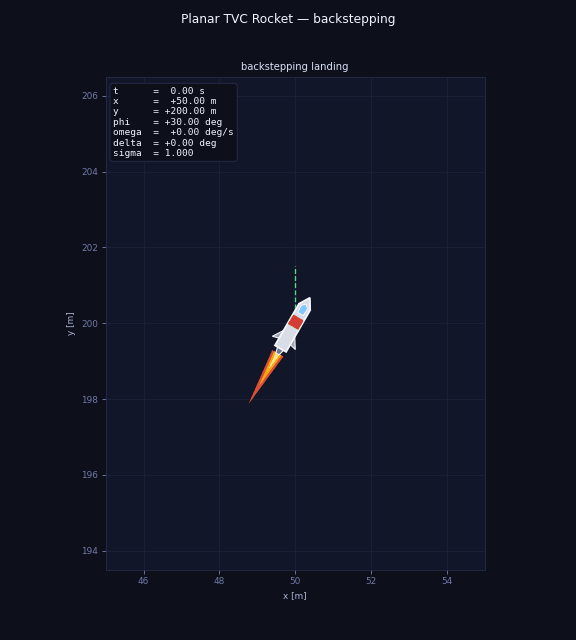

## Overview

This repository implements a **planar thrust-vector-controlled (TVC) rocket** with a full-system backstepping landing controller and a cascaded PID baseline for comparison. Both share the same rocket model, simulator, and initial conditions.

The control objective is to bring the rocket from an arbitrary initial position and attitude to the landing pad at the origin with near-zero velocity and attitude:

$$
(x, y, \dot x, \dot y, \vartheta, \dot\vartheta, \delta) \to (0, 0, 0, 0, 0, 0, 0) \quad \text{as } t \to \infty
$$

---

## Quick Start

```bash
python -m venv .venv
source .venv/bin/activate
pip install -r requirements.txt

# Backstepping controller
python -m src.main --config configs/backstepping.yaml --output-root outputs/backstepping --animate

# PID cascade baseline
python -m src.main --config configs/pid_cascade.yaml --output-root outputs/pid_cascade --animate
```

---

## Repository Structure

```
rocket_hover_energy_based/
├── configs/
│   ├── backstepping.yaml
│   └── pid_cascade.yaml
├── src/
│   ├── system.py          # 10-state ODE, rocket parameters, aerodynamics
│   ├── controller.py      # BacksteppingController and PidCascadeController
│   ├── simulation.py      # simulate(), touchdown event
│   ├── visualization.py   # diagnostic plots + GIF animation
│   └── main.py            # CLI entry point
├── figures/               # coordinate frame diagram
├── tex/figures/           # aerodynamic coefficient plots
├── outputs/
│   ├── backstepping/figures/
│   └── pid_cascade/figures/
├── backstepping_derivation.tex   # full Lyapunov derivation (LaTeX)
├── aerodynamics.tex              # aerodynamic model (LaTeX)
└── pid_controller.tex            # PID description and comparison (LaTeX)
```

---

## 1. Problem Definition

Land a planar TVC rocket at a fixed pad $x_d = 0$ m from an arbitrary initial position, attitude, and velocity. The nozzle deflection is limited to $|\delta| \leq \delta_{\max}$ and throttle to $\sigma \in [\sigma_{\min}, 1]$. The control objective is:

$$
(x, y, \dot x, \dot y, \vartheta, \dot\vartheta, \delta) \to (x_d, 0, 0, 0, 0, 0, 0) \quad \text{as } t \to \infty
$$

### Method

**Full-system backstepping** with a composite Lyapunov function covering all seven plant states simultaneously:

$$
V = \tfrac{1}{2}k_{px}e_x^2 + \tfrac{1}{2}\dot x^2 + \tfrac{1}{2}k_{py}e_y^2 + \tfrac{1}{2}\dot y^2 + \tfrac{1}{2}z_\vartheta^2 + \tfrac{1}{2}z_\omega^2 + \tfrac{1}{2}z_\delta^2
$$

Four sequential backstepping steps produce virtual controls $\vartheta^*$, $\alpha_1$, $\alpha_2$ and the real nozzle command $\delta_{\mathrm{cmd}}$. Stability under actuator saturation is proved via ISS (see `backstepping_derivation.tex`, Section 10).

### Assumptions

1. **Constant mass**: $\dot m = 0$, $\dot J = 0$, $\dot l_{cp} = 0$.
2. **All parameters known**: $C_{m\alpha}$, $C_x$, $C_{y\alpha}$, $J$, $l_{cp}$, $\tau_\delta$.
3. **Low-speed regime**: $V \leq 100$ m/s, linear aerodynamic coefficients apply.
4. **Small nozzle deflection**: $|\delta| \leq 0.262$ rad, enabling $\sin(\vartheta+\delta) \approx \sin\vartheta + \delta\cos\vartheta$.
5. **First-order nozzle actuator**: $\tau_\delta \dot\delta = -\delta + \delta_{\mathrm{cmd}}$.
6. **Full state measurement**: all 7 plant states $(x, y, \dot x, \dot y, \vartheta, \dot\vartheta, \delta)$ measurable without noise.

---

## 2. System Description

### State vector

The **plant state** (7 variables) is what the Lyapunov derivation reasons about:

$$
s = [x,\ y,\ \dot x,\ \dot y,\ \vartheta,\ \dot\vartheta,\ \delta]^T \in \mathbb{R}^7
$$

The **ODE state** integrated by the simulator is extended to 10 by three internal controller states required for numerical implementation:

$$
q = [x,\ y,\ \dot x,\ \dot y,\ \vartheta,\ \dot\vartheta,\ \delta,\ \alpha_2^f,\ \dot\vartheta^*,\ \dot\alpha_1]^T \in \mathbb{R}^{10}
$$

Control inputs: $\sigma \in [\sigma_{\min}, 1]$ (throttle) and $\delta_{\mathrm{cmd}} \in [-\delta_{\max,\mathrm{cmd}}, \delta_{\max,\mathrm{cmd}}]$.


### Equations of Motion

**Translational (small-$\delta$ linearisation):**

$$
m\ddot x = F\sin\vartheta + F\delta\cos\vartheta + X_b\sin\vartheta + Y_b\cos\vartheta
$$

$$
m\ddot y = F\cos\vartheta - mg - F\delta\sin\vartheta + X_b\cos\vartheta - Y_b\sin\vartheta
$$

**Rotational:**

$$
J\ddot\vartheta = F l_{cp} \delta + C_{m\alpha} \alpha q_\infty S_m l \quad\Longrightarrow\quad \ddot\vartheta = g_2 \delta + f_2
$$

**Nozzle actuator:**

$$
\tau_\delta \dot\delta = -\delta + \delta_{\mathrm{cmd}}
$$

### Notation

| Symbol | Meaning | Units |
|--------|---------|-------|
| $e_x = x - x_d$ | Horizontal position error | m |
| $e_y = y$ | Altitude error | m |
| $\vartheta$ | Pitch angle from vertical, positive rightward | rad |
| $g_2 = F l_{cp}/J$ | Rotational control gain | s⁻² |
| $f_2 = C_{m\alpha}\alpha q_\infty S_m l/J$ | Aerodynamic pitching moment / $J$ | rad/s² |

---

## 3. Control Law

For full derivations and formal proofs see `backstepping_derivation.tex`.

### Backstepping Error Coordinates

| Symbol | Definition | Meaning | Units |
|--------|-----------|---------|-------|
| $z_\vartheta$ | $\vartheta - \vartheta^*$ | Pitch tracking error | rad |
| $z_\omega$ | $\dot\vartheta - \alpha_1$ | Angular rate tracking error | rad/s |
| $z_\delta$ | $\delta - \alpha_2^f$ | Nozzle tracking error | rad |

### Step 1 — Desired pitch $\vartheta^*$ and throttle $\sigma$

$$
A_x = -k_{px}e_x - k_{dx}\dot x, \qquad A_y = -k_{py}e_y - k_{dy}\dot y
$$

$$
\sigma = \mathrm{clip}\left(\frac{m\sqrt{A_x^2+(A_y+g)^2}}{F_{\max}}, \sigma_{\min}, 1\right), \qquad \vartheta^* = \mathrm{atan2}(A_x, A_y+g)
$$

### Step 2 — Desired angular rate $\alpha_1$

$$
z_\vartheta = \vartheta - \vartheta^{\ast}, \qquad \alpha_1 = \dot\vartheta^{\ast} - k_\vartheta z_\vartheta, \qquad z_\omega = \dot\vartheta - \alpha_1
$$

### Step 3 — Desired nozzle angle $\alpha_2$

$$
\alpha_2 = \frac{1}{g_2}\left(-k_\omega z_\omega - z_\vartheta - f_2 + \dot\alpha_1\right), \qquad \alpha_{2,\mathrm{sat}} = \mathrm{clip}(\alpha_2, -\delta_{\max}, \delta_{\max})
$$

$z_\delta = \delta - \alpha_2^f$, where $\alpha_2^f$ tracks $\alpha_{2,\mathrm{sat}}$ with time constant $\tau_f$.

### Step 4 — Nozzle command $\delta_{\mathrm{cmd}}$

$$
\delta_{\mathrm{cmd}} = \delta + \tau_\delta\left(\dot\alpha_2^f - g_2 z_\omega - k_\delta z_\delta\right)
$$

### Stability Summary

| Claim | Status | Method |
|-------|--------|--------|
| All signals uniformly ultimately bounded | **Proved** | Composite $V$, UUB theorem |
| $\dot x, \dot y, z_\vartheta, z_\omega, z_\delta \to 0$ | **Proved** (unsaturated) | Barbalat's lemma |
| $e_x, e_y \to 0$ | **Proved** (unsaturated) | LaSalle's principle |
| UUB under all three saturations | **Proved** | ISS analysis |
| No time-scale separation needed | **Correct** | Single unified $V$ |

---

## 4. Experimental Setup

### Initial Conditions

| Variable | Value |
|----------|-------|
| $x(0)$ | 50.0 m |
| $y(0)$ | 200.0 m |
| $\vartheta(0)$ | 30.0 deg |
| $\dot x(0)$ | 10.0 m/s |
| $\dot y(0)$ | −20.0 m/s |

### Physical Parameters

| Parameter | Value |
|-----------|-------|
| $m$ | 13 000 kg |
| $F_{\max}$ | 191 763 N |
| $J$ | 318 197 kg·m² |
| $l_{cp}$ | 10.5 m |
| $\tau_\delta$ | 0.05 s |
| $\delta_{\max}$ | 15 deg |
| $\sigma_{\min}$ | 0.45 |

### Backstepping Gains

| Gain | Value | Role |
|------|-------|------|
| $k_{px}$ | 0.3 | Horizontal position |
| $k_{dx}$ | 1.5 | Horizontal velocity damping |
| $k_{py}$ | 2.0 | Vertical position |
| $k_{dy}$ | 5.0 | Vertical velocity damping |
| $k_\vartheta$ | 6.0 | Pitch error |
| $k_\omega$ | 5.0 | Angular rate error |
| $k_\delta$ | 15.0 | Nozzle error |
| $\alpha_{1,\max}$ | 1.5 rad/s | Virtual rate saturation |

---

## 5. Backstepping Results

### Animation


### Position and Velocity

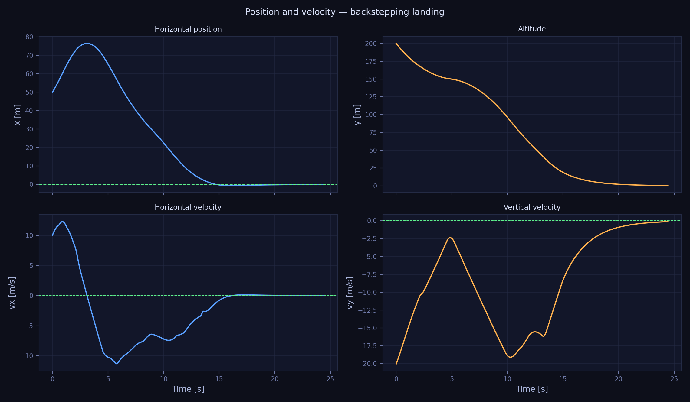

Horizontal position $x(t)$ converging to 0, altitude $y(t)$ descending smoothly, velocities decaying to zero.

### Attitude and Nozzle

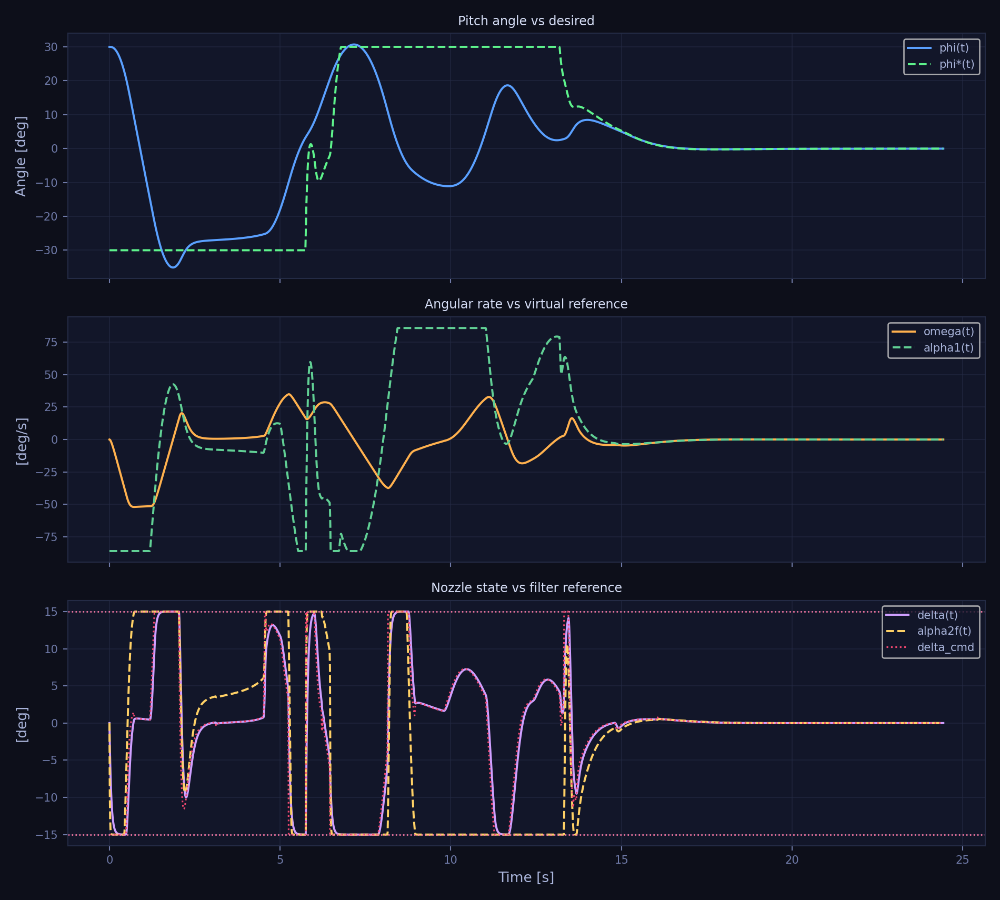

Pitch recovering from 30° to 0°. The nozzle tracks the virtual reference $\alpha_2^f$ closely throughout the manoeuvre.

### Backstepping Error Coordinates

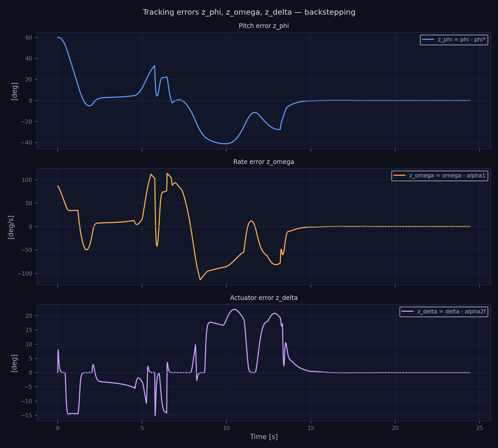

$z_\vartheta$, $z_\omega$, $z_\delta$ all converge to zero after the initial transient, confirming the Lyapunov bound.

### Lyapunov Function and Throttle

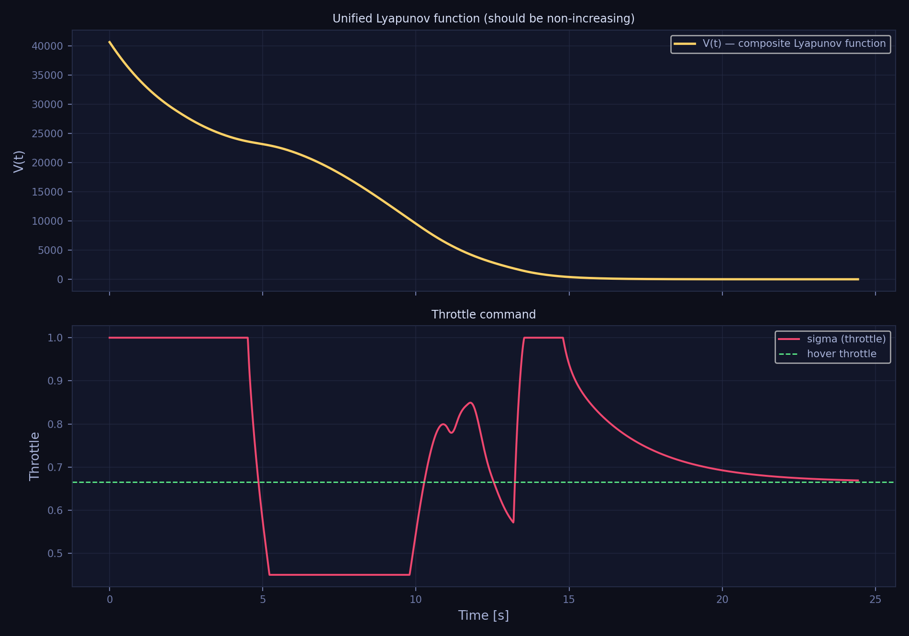

$V(t)$ is non-increasing after the initial transient. Throttle rises to 1.0 during braking, settles near hover throttle (~0.67) during descent.

### Planar Trajectory

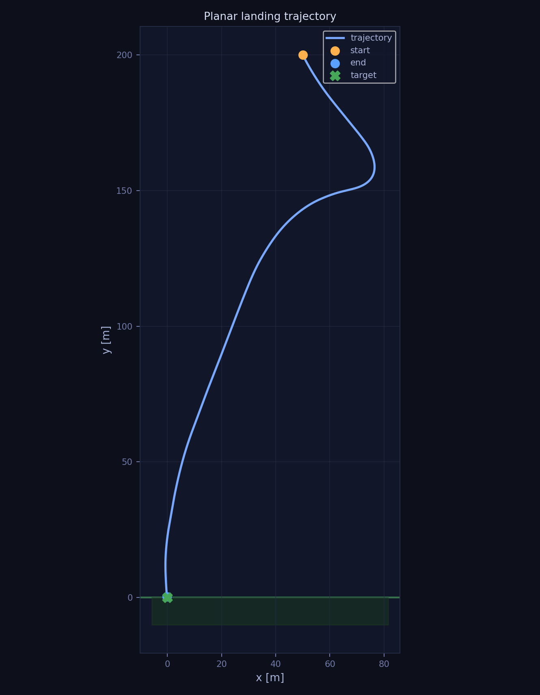

---

## 6. PID Baseline Results

The cascaded PID controller uses the same three-loop structure (position → attitude → nozzle) but omits all physics-based feedforward terms. See `pid_controller.tex` for the full description.

### Animation

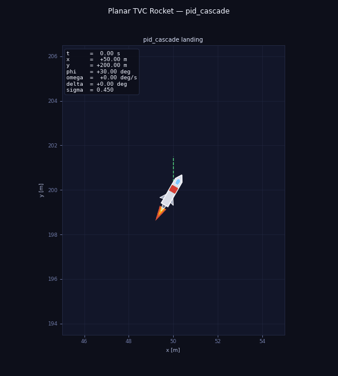

### Position and Velocity

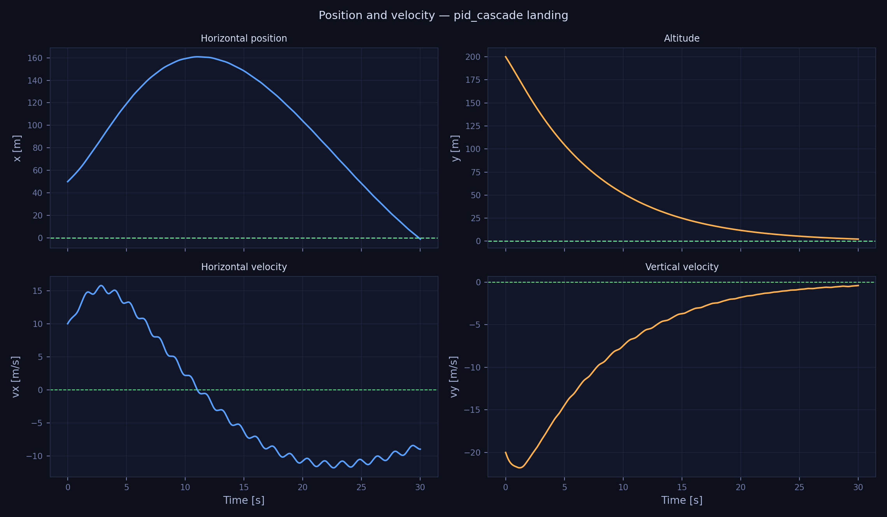

### Attitude and Nozzle

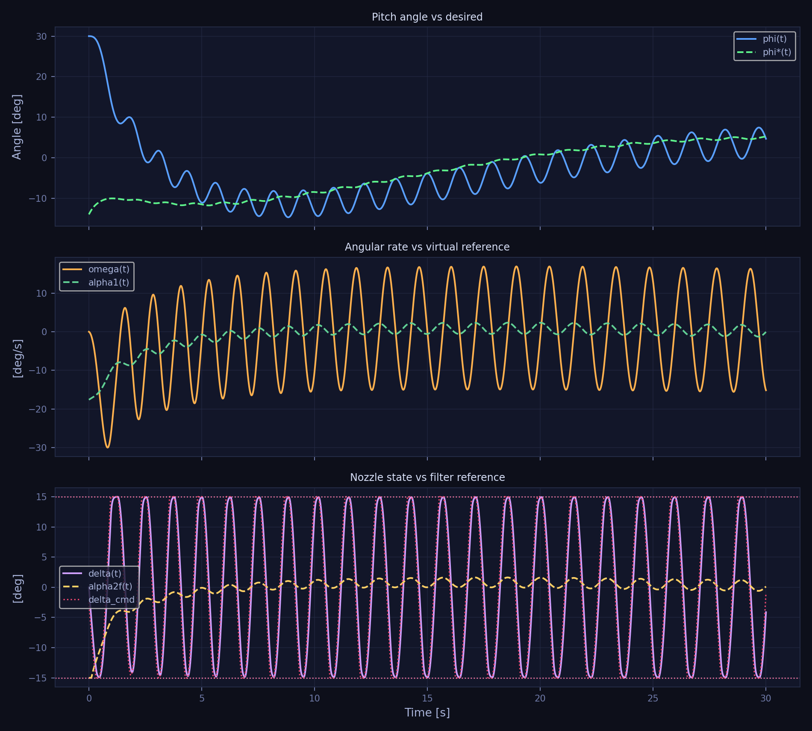

The gap between $\varphi(t)$ and $\theta^*(t)$ is larger than in backstepping — the attitude loop lags because it has no $\dot\theta^*$ feedforward.

### Tracking Errors

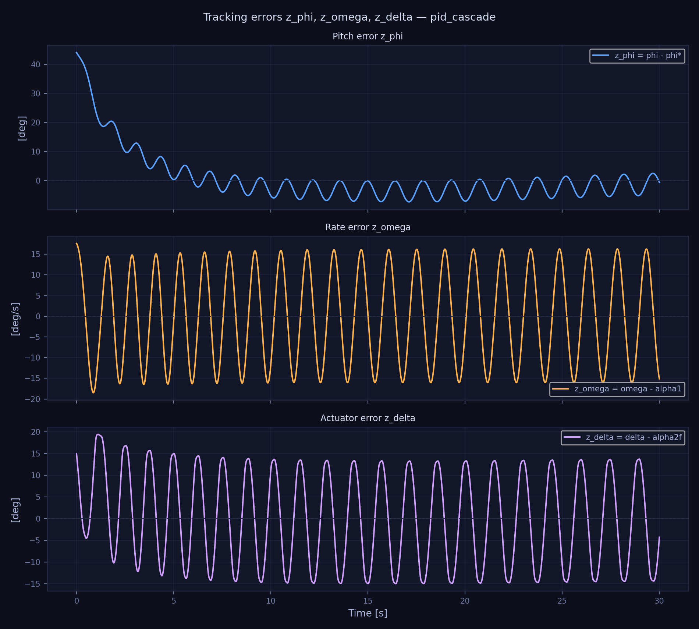

### Lyapunov Function and Throttle

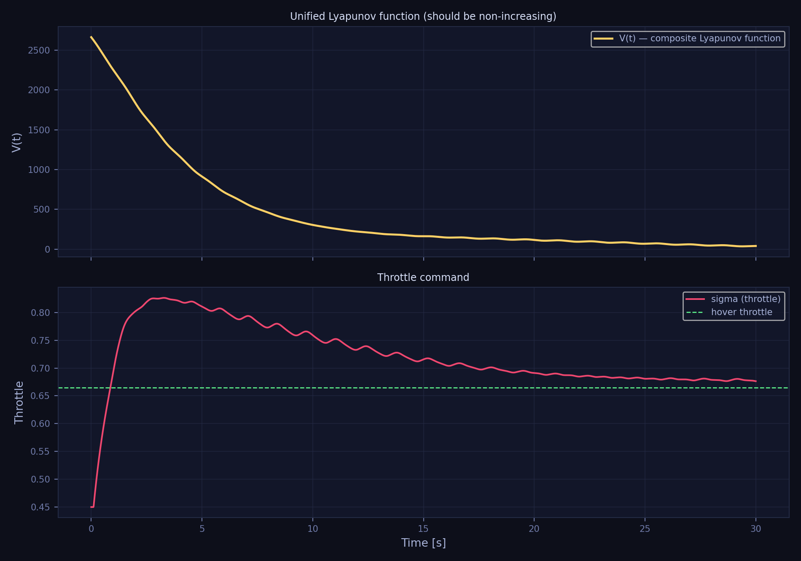

### Planar Trajectory

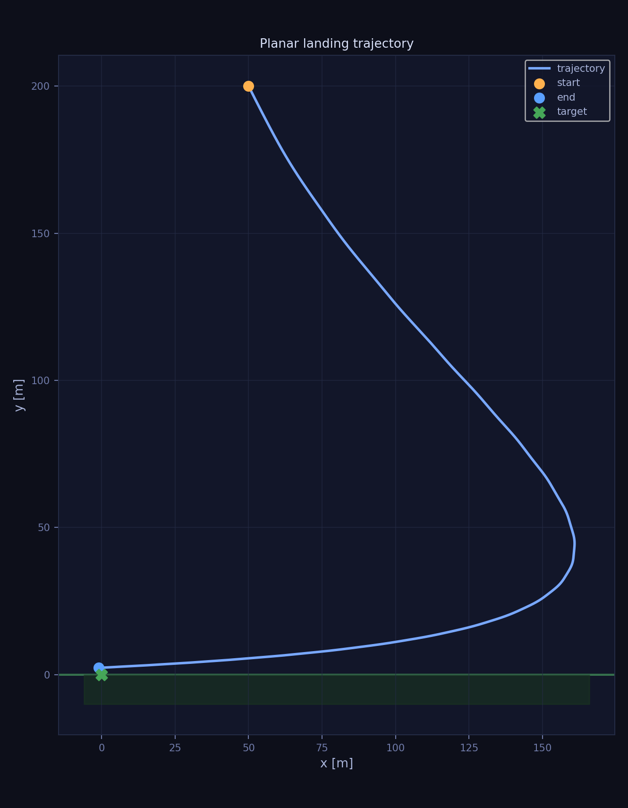

---

## 7. Controller Comparison

Both controllers started from identical initial conditions: $x_0 = 50$ m, $y_0 = 200$ m, $\dot x_0 = 10$ m/s, $\dot y_0 = -20$ m/s, $\vartheta_0 = 30°$.

| Metric | Backstepping | PID cascade |
|--------|:-----------:|:-----------:|
| Landing time | **24.4 s** | Did not land (30 s timeout) |
| Final speed | **0.13 m/s** | 8.97 m/s |
| Final $x$ error | **−0.10 m** | −0.99 m |
| Final $y$ | **0.30 m** | 2.29 m |
| Final $\vartheta$ | **−0.03 deg** | 4.66 deg |
| Final $\dot\vartheta$ | **0.007 deg/s** | −15.16 deg/s |
| Max $\vartheta$ | 35.1 deg | 30.0 deg |
| Max $\delta$ | 15.0 deg | 15.0 deg |
| Lyapunov $V$ at end | **0.10** | 40.5 |
| Stability guarantee | **Lyapunov UUB** | Gain-dependent |

### Why the Difference

The backstepping controller carries explicit knowledge of the rocket's physics into every step:

| Feedforward term | Backstepping | PID | Effect of absence in PID |
|-----------------|:---:|:---:|--------------------------|
| $\dot\theta^*$ in $\alpha_1$ | ✓ | ✗ | Attitude loop lags a moving target — slower recovery |
| $f_2 = C_{m\alpha}\alpha q_\infty S_m l/J$ in $\alpha_2$ | ✓ | ✗ | Aerodynamic pitch moment acts as uncompensated disturbance |
| $\dot\alpha_1$ in $\alpha_2$ | ✓ | ✗ | No feedforward of desired rate-of-rate |
| $Q$-coupling in $\delta_{\mathrm{cmd}}$ | ✓ | ✗ | Velocity–nozzle coupling uncompensated |

The backstepping controller pre-rotates the rocket before the position error demands it (because it knows $\dot\theta^*$), producing a smooth trajectory and near-zero touchdown speed. The PID reacts only after the error has grown, resulting in a high residual speed and failure to land within the simulation window.

---

## 8. Possible Extensions

- **Fuel-optimal descent**: Replace the proportional position law with a minimum-fuel guidance (e.g., powered-explicit-guidance or lossless convexification).
- **Robustness to parameter uncertainty**: Combine backstepping with online adaptive estimation of $C_{m\alpha}$ — the matched-uncertainty structure means the estimate plugs directly into the $f_2$ cancellation term in (VC2).
- **3D extension**: Extend the planar model to 6-DOF with yaw and roll channels.
- **Wind disturbances**: Add bounded wind as an ISS disturbance input and verify the quantitative bounds.

---

## 9. Notes on AI Use

AI assistance was used to help scaffold code structure, organise documentation, and check mathematical notation consistency. All equations, proofs, and physical interpretations were reviewed and verified before submission.
