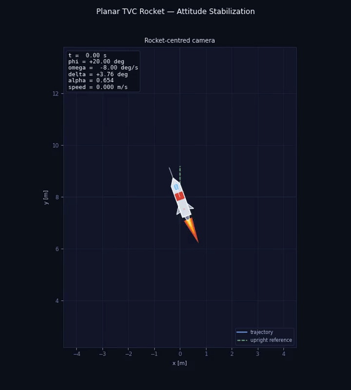
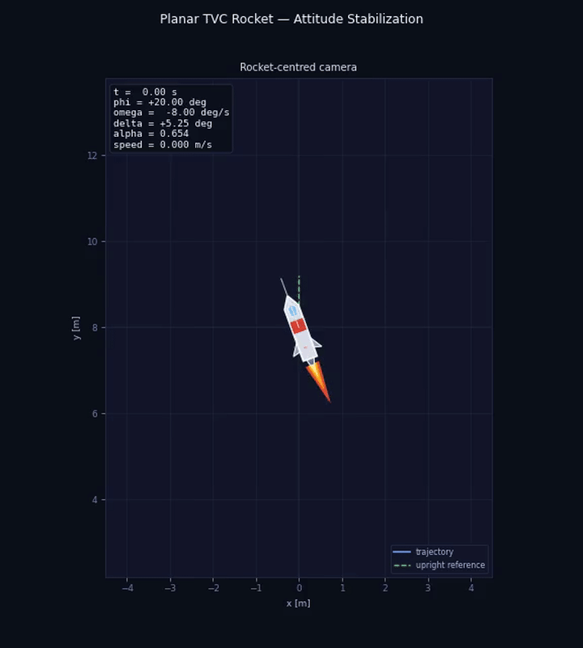

# Attitude Stabilization Results

This file combines all main results of the planar TVC rocket attitude-stabilization study in one place. For each of the five tested cases, it includes a short explanation, the corresponding plots, and the GIF animation. After the per-case sections, a summary table with settling times is provided, followed by the 3D settling-time surface over the controller gains.

## 1. Controller idea

The angular motion model is:

<strong>&phi;&quot; = -( &alpha; Fmax lcp / J ) sin(&delta;)</strong>

The controller computes:

<strong>e&phi; = wrap(&phi; - &phi;target)</strong>

<strong>sin(&delta;) = ( J / ( &alpha; Fmax lcp ) ) ( k&phi; e&phi; + k&omega; &omega; )</strong>

so the closed-loop angular dynamics become:

<strong>&phi;&quot; = -( k&phi; e&phi; + k&omega; &omega; )</strong>

<strong>e&phi;' = &omega;</strong>

<strong>e&phi;&quot; + k&omega; e&phi;' + k&phi; e&phi; = 0</strong>

Here:

- `k_phi` controls how strongly the rocket is pulled back toward the target angle
- `k_omega` controls how strongly the angular velocity is damped

The stabilization criterion used in all cases is:

<strong>|e&phi;(t)| = |wrap(&phi;(t) - &phi;target)| &lt; 0.1 rad</strong>

with <strong>&phi;(0) = 20&deg;</strong> and <strong>&phi;target = 0&deg;</strong>.

## 2. Default case

The `default` case corresponds to the baseline controller configuration. It gives a fast and clean response with moderate nozzle activity and only a small overshoot. The settling time for this case is `0.4931 s`.

**Parameters:** `k_phi = 18.0`, `k_omega = 7.0`

### Default plots

### Default GIF

## 3. Soft case

The `soft` case uses a small `k_phi` and moderate damping. Because the restoring action is weaker, the response is smoother but slower, and the rocket needs more time to reach the target region. The settling time for this case is `0.8125 s`.

**Parameters:** `k_phi = 6.0`, `k_omega = 4.0`

### Soft plots

### Soft GIF

## 4. Balanced case

The `balanced` case combines a moderate restoring term with strong damping. It gives the cleanest overall motion, with a fast response and almost no visible overshoot. The settling time for this case is `0.6111 s`.

**Parameters:** `k_phi = 14.0`, `k_omega = 7.0`

### Balanced plots

### Balanced GIF

## 5. Fast case

The `fast` case uses the largest `k_phi` among the tested presets while keeping strong damping. It reaches the target region the quickest, but this also leads to more aggressive nozzle motion and a sharper response. The settling time for this case is `0.3889 s`.

**Parameters:** `k_phi = 24.0`, `k_omega = 7.0`

### Fast plots

### Fast GIF

## 6. Springy case

The `springy` case keeps a strong angle-correction term but reduces damping significantly. As a result, the response becomes oscillatory and visibly underdamped, which makes this case the slowest to settle. The settling time for this case is `0.9792 s`.

**Parameters:** `k_phi = 18.0`, `k_omega = 2.0`

### Springy plots

### Springy GIF

## 7. Summary table

<table>
  <thead>
    <tr>
      <th>Case</th>
      <th>k_phi</th>
      <th>k_omega</th>
      <th>Settling time [s]</th>
    </tr>
  </thead>
  <tbody>
    <tr>
      <td>Default</td>
      <td>18.0</td>
      <td>7.0</td>
      <td>0.4931</td>
    </tr>
    <tr>
      <td>Soft</td>
      <td>6.0</td>
      <td>4.0</td>
      <td>0.8125</td>
    </tr>
    <tr>
      <td>Balanced</td>
      <td>14.0</td>
      <td>7.0</td>
      <td>0.6111</td>
    </tr>
    <tr>
      <td>Fast</td>
      <td>24.0</td>
      <td>7.0</td>
      <td>0.3889</td>
    </tr>
    <tr>
      <td>Springy</td>
      <td>18.0</td>
      <td>2.0</td>
      <td>0.9792</td>
    </tr>
  </tbody>
</table>

The table shows that the `fast` preset gives the shortest settling time, while the `springy` preset gives the longest one because of weak damping. The `default` and `balanced` cases provide a good compromise between speed and smoothness, whereas `soft` is slower but visually gentler.

## 8. 3D settling-time surface

The figure below shows how the settling time depends on the controller gains `k_phi` and `k_omega`. It was generated from 60 simulation points on a regular grid in the `(k_phi, k_omega)` plane. The best region is the valley on the surface, where `k_phi` is moderate to high and `k_omega` is large enough to damp the motion well. When `k_omega` becomes too small, the response becomes oscillatory and the settling time increases.

## 9. Conclusion

The obtained results confirm the expected roles of the controller gains in the attitude-stabilization problem. The coefficient `k_phi` mainly determines how quickly the rocket is driven back toward the target angle, while `k_omega` determines how strongly the angular motion is damped during the transient process. Increasing `k_phi` generally reduces the settling time, but only if `k_omega` is sufficiently large; otherwise the response becomes oscillatory and the stabilization time grows again. This trend is visible both in the individual case comparisons and in the 3D settling-time surface.

Among the five tested cases, the `fast` preset produced the shortest settling time, `0.3889 s`, while the `springy` preset produced the longest one, `0.9792 s`, because of weak damping and noticeable oscillation. The `default` and `balanced` cases gave the most practical compromise between speed and smoothness, with fast convergence and limited overshoot. The `soft` case remained stable and visually smooth, but its weaker restoring action made the convergence slower. Overall, the study shows that the best controller performance is achieved for balanced combinations of `k_phi` and `k_omega`, where correction is fast enough and damping is still strong enough to suppress oscillations.
